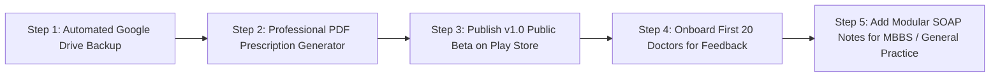
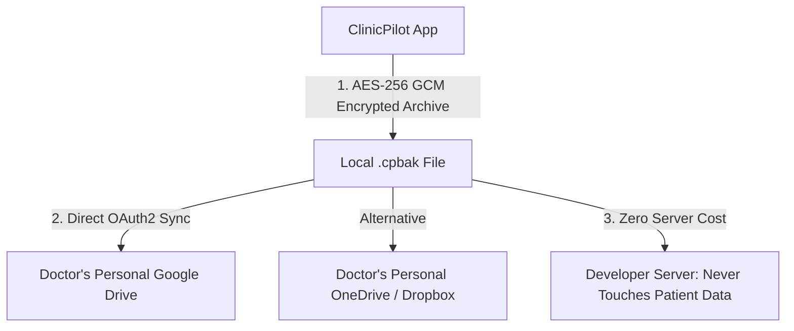
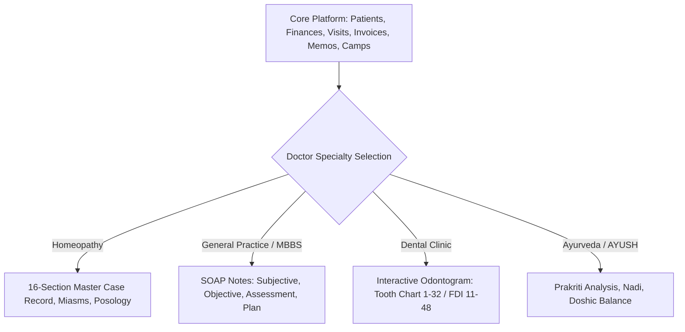

query- 
see my idea is to make this app public user/doctor use, when it tested well proved, but question and doubts are so many, i never make any app public, and also way to monitze this app as well. current app state is right position to make it public? the feature right is good enough? or make more feature befroe make it public? what more good feature we can take it up from all above projects (for that we need to gather all the features from each project and deep down list down in on md file). currently app is only offline, but i idea was to make it online cloud backup support, and more support for other doctors like dental, mbbs, general, specialist doctors, but to start quick i kept this out from milestone of develoopment plan. now make it cloud back enable before public, and how to motize it. via adds or subscription, or one time payment(as public is in intial phase of app no one go with one time payment obviously), and many more question and doubts i have, does ui/ux fit for people? currently app solves only homeophathy doctor clinic proccess, not for others like mbbs, general doctor, dental doctor, specialist, 
i know this app is only meant or targeting to small doctor with indipendent doctor with one or more clinic without any assistent, this area is not proven to extact money out easily, only big firm or good doctor having good setup may afford or likely to get or jump to purchase, small clinic is difficult, and if i talk about india, i know there many small doctor, medium level doctor and big firms, (if i say small doctor mean, less infra, less, small area of people coverage.. and more params). we need to more data demographic data to make furthure decisions. but still which area to target first. what plan to make to cover more. where i can get more audience/doctor/users for my app. and also i have to promote(but i have no money to promote, what mroe better ways)

----

---

### 1. Is ClinicPilot in the right position to go public now?

**Yes, absolutely — but as a focused Public Beta for Solo & Homeopathic Doctors.**

- **Why it is ready**:
  - The codebase has **367 automated tests**, 0 analyzer warnings, rock-solid SQLite ACID reliability, SQLCipher AES-256 encryption, Biometric lock, and full CI/CD.
  - It solves the real daily headaches of solo doctors: calculating net profit after rent, recording deep clinical histories, tracking retention, and sending WhatsApp follow-up reminders.
- **The biggest risk to avoid**:
  - Waiting until you add cloud servers, dental tooth charts, and hospital billing before launching. Building for months in isolation without real users leads to building features no one actually uses.
  - **Launch now with what you have, get 20 real doctors using it, and let their real daily feedback guide the next features.**

---

### 2. The Cloud Dilemma: How to add Cloud Backup with ₹0 Server Cost

You expressed wanting cloud backup before going public, but you don't have a budget for servers. 

**Do NOT build a centralized cloud backend (AWS/Supabase/Firebase) right now.**
- Centralized servers cost money every month even if doctors use the app for free.
- Hosting patient records on your servers makes you legally liable under India’s Digital Personal Data Protection (DPDP) Act.
- Doctors in India fear third parties stealing their patient records.

#### The Zero-Cost Solution: "Doctor-Owned" Google Drive Sync
- Integrate **Google Drive AppData API** directly into ClinicPilot.
- The app exports its encrypted `.cpbak` backup file directly into the **doctor’s own personal Google Drive** once a day.
- **Cost to you**: **₹0.00**.
- **Security & Privacy**: 100% private to the doctor. You never touch, see, or store their medical records.

---

### 3. Monetization in India: Ads vs. Subscription vs. One-Time

| Model | Viability in India | Why / Why Not |
| :--- | :---: | :--- |
| **Advertisements (AdMob)** | ❌ **Terrible Idea** | Banner ads in a medical app look cheap, unprofessional, and destroy doctor trust. No doctor wants an ad popping up during a patient consultation. |
| **High One-Time Payment (₹3,000–₹5,000)** | ❌ **High Resistance** | Indian doctors will never pay upfront for an unknown app they haven't tested. |
| **Freemium + Doctor Business Pack** | ✅ **Proven Model** | Give the core offline clinic app 100% free. Charge a modest subscription (**₹199 – ₹299/month** or **₹1,999/year**) for business/convenience upgrades. |

#### What Goes into the Paid "Pro" Tier?
1. **Automated Google Drive Cloud Backup** (peace of mind if they lose/break their phone).
2. **Branded Prescription PDF Generator** (Doctor's clinic logo, digital signature, clinic registration number, and custom letterhead).
3. **Advanced Analytics & Tax Summaries** (Yearly income/expense statements for their accountant).
4. **Priority Doctor Support on WhatsApp**.

> **The Psychology of ₹199/month**: ₹199 is less than the fee of a single consultation in India. If the app saves just 1 patient from dropping out each month, it has paid for itself 10x over.

---

### 4. Why Targeting Homeopathy First is a Massive "Unfair Advantage"

You mentioned: *"Currently app solves only homeopathy doctor clinic process, not for others like MBBS, general doctor, dental..."*

**That is not a weakness; it is your greatest strength.**
- **The Red Ocean**: Practo, Lybrate, and Tata 1mg fight over urban allopathic (MBBS) hospitals.
- **The Blue Ocean**: There are over **300,000 registered Homeopathic doctors** and over **700,000 AYUSH practitioners** in India. Almost **nobody builds specialized software for them**. 
- General EHRs do not have Miasmatic analysis, mental symptom repertory modalities, or homeopathic remedy potencies. ClinicPilot is one of the only modern mobile apps that genuinely understands their clinical workflow.

#### How to Expand to MBBS and Dental later (Modular Engine)
Without rewriting the app, we can introduce a **Specialty Switcher** in Settings:
- **Homeopathy**: 16-section Master Case Record + Posology.
- **General Practice (MBBS / Polyclinic)**: Universal **SOAP Notes** (Subjective, Objective, Assessment, Plan) + Vital charts (BP, Blood Sugar, SpO2).
- **Dental**: Interactive 32-tooth odontogram chart (Tooth 1–32 / FDI numbering).

---

### 5. Zero-Budget Marketing: How to Get Your First 500 Doctors

You do not need money for Instagram or Google ads. Medical software in India spreads through **peer trust, professional associations, and word-of-mouth**:

1. **Medical College Interns & Fresh Graduates (BHMS / MD Hom)**:
   - Final-year students and fresh graduates starting their first independent clinic or clinic rotation have zero budget and no software.
   - Introduce ClinicPilot directly to medical college student unions and resident doctor groups.
2. **Homeopathic Medical Associations**:
   - Reach out to local chapters of:
     - **HMAI** (Homoeopathic Medical Association of India)
     - **IIHP** (Indian Institute of Homoeopathic Physicians)
     - State-level AYUSH doctor WhatsApp / Telegram groups.
3. **The "Prescription Viral Loop"**:
   - In the free tier, when a doctor shares or prints a digital prescription or bill, add a subtle, clean footer:
     *Generated securely via ClinicPilot — Free Offline Clinic Tool*.
   - Patients and visiting colleagues who see the clean digital Rx will naturally discover the app.
4. **Onboard 10–20 Local Doctors in Person**:
   - Visit 10 solo homeopathic or general clinics in your area.
   - Say: *"Doctor, I built a fast, 100% offline practice app that runs completely privately on your phone without monthly server fees. Can I set it up for you and get your honest feedback?"*
   - Watch them use it. You will learn more in 5 days of real clinic observation than in 6 months of guessing.

---

### Proposed Immediate Roadmap (Path to Public v1.0)



1. **Automated Google Drive Backup**: Gives doctors complete confidence that their data will never be lost.
2. **Professional PDF Prescription Generator**: Allows doctors to print or WhatsApp a clean digital Rx with their clinic letterhead.
3. **Publish to Google Play Store** under the title: *ClinicPilot: Offline Clinic & Case Record for Doctors*.

Whenever you are ready, we can start with the **Google Drive Backup** or the **PDF Prescription generator**!


----
📄 **[ClinicPilot Product & Monetization Masterplan](file:///C:/Users/Lenovo/.gemini/antigravity/brain/6af62886-0837-4c33-af5f-8320691d066e/clinicpilot_product_and_monetization_masterplan.md)**

# ClinicPilot: Public Launch, Monetization & Feature Expansion Masterplan

## 1. Executive Assessment: Is ClinicPilot Ready for Public Launch?

### Current Status (v0.8.8)
- **Stability**: High (367 automated tests passing, 0 lint warnings, hardened CI/CD pipeline).
- **Core Clinical Value**: Deep, structured 16-section Homeopathic Master Case Record, Complaint Progression, Posology/Prescriptions, Pathology Investigation Log, Media attachments.
- **Core Business Value**: Multi-clinic cash memos, expense tracking, net profit calculation, retention rate, Camp ROI, Referral CRM, Google Review tracking.
- **Data Security**: On-device SQLite with SQLCipher AES-256 encryption at rest, PIN + Biometric app lock, encrypted `.cpbak` manual backup.

### Honest Verdict
> [!IMPORTANT]
> **Yes, ClinicPilot is ready for a Public Beta / v1.0 Launch — but specifically as a focused solution for Homeopathic & Solo Wellness Doctors.**
> Do **NOT** delay public launch waiting to build cloud backends, dental tooth-charts, or full hospital modules. The biggest mistake indie developers make is building for a year in isolation for "everyone" and launching to no one. Launching to a targeted niche first builds real doctor trust, real feedback, and immediate product-market fit.

---

## 2. Competitor Feature Extraction & Cross-Project Inventory

Analyzing the 5 benchmark platforms (**OpenEMR, Frappe Health, Medplum, HospitalRun, Medinin**) highlights high-value features ClinicPilot can adopt without compromising its lightweight, offline-first philosophy:

| Benchmark Project | Extracted High-Impact Features | Adaptability for ClinicPilot | Priority |
| :--- | :--- | :--- | :---: |
| **OpenEMR** | 1. Professional PDF Rx generator with clinic letterhead/stamp.<br>2. Generic SOAP note template for general medicine.<br>3. Drug/Remedy interaction alerts.<br>4. Custom intake questionnaires. | **High**: PDF Rx generation is a doctor's #1 daily need.<br>**High**: SOAP notes unlock MBBS/general practice. | **P1 (Launch Polish)** |
| **Frappe Health** | 1. Medicine dispensing & stock inventory (bottles, dilutions).<br>2. Doctor commission & referral split calculation.<br>3. Patient queue / waiting-room token slip.<br>4. Re-order level notifications for medicines. | **Medium**: Basic in-clinic dispensing inventory is valuable for solo homeopaths who dispense their own sugar pills/dilutions. | **P2 (Post-Launch)** |
| **HospitalRun** | 1. Simplified diagnostic test ordering.<br>2. Visual pathology trend graphing.<br>3. Patient discharge/case summary sheet. | **High**: Visual trend graphs for blood sugar, BP, or pathology tests over time. | **P2** |
| **Medplum** | 1. Standardized data schemas (HL7 FHIR JSON export).<br>2. Event-driven reminder webhooks / SMS dispatch.<br>3. Multi-device sync architecture. | **Medium**: Exporting patient records to standard FHIR JSON allows interoperability with hospital systems. | **P3 (Enterprise)** |
| **Medinin** | 1. Patient education visual aids / diagrams.<br>2. Local push notification appointment alerts.<br>3. Quick 1-tap CSV/Excel patient registry export. | **High**: Local notification reminders 15 mins before scheduled visits. | **P1 (Quick Win)** |

---

## 3. The Cloud Backup Dilemma: Zero-Cost Architecture

### The Problem
If you build a custom centralized cloud server (AWS, Supabase, Firebase) for all doctors:
1. **Server Costs**: You pay hosting and database fees every month, even for free users.
2. **Legal & Compliance Nightmare**: In healthcare, hosting patient data on your servers makes you liable under data privacy laws (India's DPDP Act, HIPAA, GDPR). You become responsible for data breaches.
3. **Doctor Distrust**: Indian doctors are fiercely protective of their patient records and fear that cloud platforms will sell their patient leads to pharmacies or corporate hospital chains.

### The Solution: "Zero-Knowledge" User-Owned Cloud Backup
Instead of hosting their data on your server, let the doctor backup to **their own cloud storage**:



1. **Google Drive / OneDrive Integration**:
   - The app requests permission only to its own hidden app data folder (`drive.appdata` scope).
   - Once a day or on app exit, the app automatically uploads the encrypted `.cpbak` archive directly to the doctor's Google Drive.
2. **Advantages**:
   - **Cost to You**: **$0.00**. Google Drive gives every user 15GB free storage.
   - **Liability to You**: **Zero**. You never hold, see, or store medical data.
   - **Doctor Trust**: 100%. Doctors know only they have the encryption password and Google login.

---

## 4. Monetization Strategy for Indian Doctors

### Why Traditional Ads and Expensive Upfront Costs Fail
- **Ads (AdMob/Banner ads)**: **Never use banner ads in a medical app.** It looks cheap, unprofessional, and destroys trust. No doctor wants an advertisement popping up while taking a patient's case history.
- **High One-Time Price (e.g. ₹5,000 upfront)**: Conversion will be near zero because new users don't trust an unknown app enough to pay upfront.

### The Winning Model: Freemium with "Doctor Business Pack"

```
┌─────────────────────────────────────────────────────────────────────────┐
│                        CLINICPILOT PRICING TIERS                        │
├──────────────────────────────┬──────────────────────────────────────────┤
│ FREE TIER (100% Offline)     │ PRO TIER (₹199 - ₹299 / month or ₹1,999/yr)│
├──────────────────────────────┼──────────────────────────────────────────┤
│ • Unlimited Patients & Visits│ • Automated Daily Google Drive Cloud Sync │
│ • 16-Section Case Taking     │ • Customized PDF Rx with Digital Letterhead│
│ • Local Financial Tracking   │   (Clinic Logo, Signature, Registration No)│
│ • Basic WhatsApp Reminders   │ • Advanced Practice Intelligence Reports │
│ • Manual Local Device Backup │   (Yearly Tax Summary, Disease Analytics)│
│                              │ • Priority WhatsApp Doctor Support       │
└──────────────────────────────┴──────────────────────────────────────────┘
```

#### Why Indian Doctors Will Pay ₹199–₹299/Month (or ₹1,999/Year):
1. **The Price Anchoring**: ₹199 is less than the consultation fee of a single patient! If the app saves them 1 patient from dropping out per month, it pays for itself 10x over.
2. **Essential Peace of Mind**: The #1 fear of solo doctors using a mobile app is: *"What if I lose my phone or break it?"* Automated Google Drive Cloud Sync directly solves this fear.
3. **Professional Pride**: Doctors love handing out clean, beautifully formatted PDF prescriptions with their name, clinic registration number, and clinic logo via WhatsApp or portable thermal printer.

---

## 5. Expanding Beyond Homeopathy: Modular Specialty Architecture

To scale from Homeopathy to General Practice (MBBS), Dental, and Specialists, ClinicPilot does **not** need a complete rewrite. It needs a **Modular Clinical Engine**:



### Rollout Order:
1. **Phase 1 (Now)**: Homeopathy + General Wellness (Polish to perfection).
2. **Phase 2 (v1.1)**: **General Practice (MBBS / Polyclinic)**: Add universal SOAP notes (Subjective, Objective, Assessment, Plan) with quick vital logs (BP, Sugar, SpO2, Pulse). This alone expands your addressable market by 500%.
3. **Phase 3 (v1.2)**: **Dental**: Add a visual 32-tooth interactive chart with cavity/extraction markers. Dental clinics are notoriously high-revenue and willing to pay.

---

## 6. Zero-Budget Doctor Acquisition & Growth Plan in India

You do not need a paid advertising budget to acquire your first 500 to 1,000 active doctors in India. Healthcare adoption in India is driven by **peer trust and community credibility**:

### 1. The Homeopathic & AYUSH Community Gateway (Blue Ocean)
- Big players (Practo, Lybrate) completely ignore Homeopathic and AYUSH doctors—they design only for corporate Allopathic hospitals.
- **Action**:
  - Connect with **BHMS / MD (Hom)** colleges and final-year student batches. Junior doctors starting their first independent clinic have zero budget for expensive software and desperately need an easy mobile solution.
  - Reach out to local chapters of homeopathic associations:
    - **HMAI** (Homoeopathic Medical Association of India)
    - **IIHP** (Indian Institute of Homoeopathic Physicians)
    - State AYUSH medical groups on WhatsApp and Telegram.

### 2. "Show Your Rx" Growth Loop
- Every prescription or bill generated in the free tier can have a discreet footer:
  *Generated securely with ClinicPilot — Private Clinic Practice Tool*.
- Patients and visiting colleagues who see the clean digital Rx ask their doctor what software they are using.

### 3. Google Play Store ASO (App Store Optimization)
- Optimize the app store title and keywords for search queries solo doctors actually type:
  - *"Clinic management app for doctors"*
  - *"Homeopathy case taking app"*
  - *"Doctor prescription maker offline"*
  - *"Patient record book for clinic"*
- Highlight **100% Offline & No Internet Needed** in the app banner, because Tier-2/3 clinic doctors frequently suffer from spotty clinic connectivity.

### 4. Direct Doctor Feedback Demos (First 20 Doctors)
- Personally onboard 20 local homeopathic and general practice doctors in your city.
- Sit with them for 30 minutes, watch them enter 1 real case, observe where they get confused or tap the wrong button, and refine the UI based on real clinic usage.
- Doctors who feel heard become lifelong brand ambassadors who recommend the app in their doctor WhatsApp circles.


----

We will look at hard numbers, Indian doctor psychology, business realities, and technical architecture.

---

### 1. First, Medical Terminology: What Does "Rx" Mean?

In medicine and healthcare:
- **"Rx"** is the universal abbreviation for a **Medical Prescription**.
- It originates from the Latin word **_Recipe_**, which means *"Take thou"* or *"Take this"*. 
- On every doctor's letterhead across the globe, you see the **℞** symbol printed at the top-left before the doctor writes medicines, dosages, and instructions.
- When we say **"PDF Rx Generator"**, it means the tool that compiles the patient’s diagnosis, complaints, prescribed remedies/potencies, dosage repetition, diet restrictions, and doctor signature into a clean, printable PDF prescription that the doctor can hand over or send to the patient on WhatsApp.

---

### 2. Grilling the "Freemium vs. Paywall Later" Dilemma: Is It a Betrayal?

> **Your Thought**: *"Should we release all features free now, and in the future lock some as premium? Is that a betrayal to users? Or should we segregate free vs premium before releasing?"*

#### The Brutal Truth: It IS a Betrayal (The "Bait-and-Switch" Trap)
If you give doctors a feature for free today (e.g., full export, disease analytics, unlimited visits) and 6 months later put a paywall in front of it, **users will feel cheated and revolt**.
- In the Google Play Store, this is called a **"Bait and Switch"**.
- What happens? Doctors will immediately drop your rating from 4.8 stars to **1.2 stars with angry reviews**: *"Greedy developer! Gave it free, trapped my data, and now asking for money! Uninstalled!"*
- Once an app gets 1-star reviews on the Play Store, its algorithm kills its visibility. You can never recover from that.

#### The Golden Rule of Software
> **Whatever is Free on Day 1 must stay Free Forever.**

#### How to Do It Properly: Segregate the Boundary on Day 1
You do **not** need to build the payment gateway or billing code today. But you must define the boundary from the start:

```
┌────────────────────────────────────────────────────────────────────────┐
│                        THE SACRED BOUNDARY                             │
├────────────────────────────────────┬───────────────────────────────────┤
│ CORE CLINIC ENGINE (Free Forever)  │ CONVENIENCE & BUSINESS (Pro Tier) │
├────────────────────────────────────┼───────────────────────────────────┤
│ • Taking cases & writing visits    │ • Automated Daily Google Drive    │
│ • Searching patients & history     │   Cloud Backup                    │
│ • Local manual backup (.cpbak)     │ • Custom PDF Letterhead Branding  │
│ • Viewing expenses & income        │   (Logo, Signature, Header)       │
│ • Direct WhatsApp chat link        │ • Multi-device Local LAN Sync     │
│ • 100% Offline, no limit on cases  │ • Advanced Annual Tax Statements  │
└────────────────────────────────────┴───────────────────────────────────┘
```
- **Why this works**: The doctor can run their clinic completely free without ever feeling blocked or held hostage. The paid features are **convenience boosters** (cloud peace of mind, professional clinic branding) that doctors are happy to pay for as their clinic grows.

---

### 3. Grilling the "Ads (AdMob) in Doctor Apps" Thought

> **Your Thought**: *"In India people want free tools. Should we show freemium without ads for 2-3 weeks, and then show ads? To remove ads they must purchase?"*

Let's do the hard math of advertising in India:

#### 1. The Financial Math of Mobile Ads in India
- In India, Google AdMob pays an average **eCPM of ₹30 to ₹60 ($0.35 – $0.70)** per 1,000 banner/interstitial impressions.
- A busy solo doctor consults 25 patients a day. That generates roughly 50 to 80 screen views per day = **1,500 views a month**.
- Your monthly advertising revenue from that doctor:
  $$\frac{1,500}{1,000} \times ₹40 \approx \mathbf{₹60\text{ per month (less than \$0.75)}}$$
- **You are trading your entire reputation, dignity, and professional trust for ₹60 a month.**

#### 2. The Psychology of a Patient Consultation
Picture this scenario:
> A patient is sitting in front of the doctor explaining severe depression, migraine, or chronic arthritis. The doctor opens ClinicPilot on their phone to record the case. Suddenly, a full-screen popup ad for **"Dream11 Fantasy Cricket"**, **"Rummy Circle"**, or a shampoo advertisement pops up with loud music.

What happens?
1. The doctor is deeply embarrassed in front of the patient.
2. The patient thinks: *"Is this doctor using a cheap, shady mobile game app to store my private medical data?"*
3. The doctor uninstalls ClinicPilot within 10 seconds and warns all their colleagues on WhatsApp never to download it.

#### Solid Conclusion:
**Zero Ads. Never put ads in a healthcare workflow.** 
Professional B2B tools (Khatabook, Vyapar, Zoho, Doxper) never show third-party consumer ads. They build trust through a clean, respectful interface.

---

### 4. Market Analysis & Doctor Demographics in India

> **Your Observation**: *"Homeopathy doctors earn less compared to MBBS/Dental, so they won't pay."*

Let’s look at real demographic data from India:

#### 1. How Many Doctors Are There? (Ministry of AYUSH & NMC Data)
- **Registered Homeopathic Doctors**: **~325,000+** in India.
- **AYUSH Total (Ayurveda + Homeopathy + Unani)**: **~850,000+**.
- **Allopathic (MBBS) Doctors**: **~1,300,000** (mostly concentrated in corporate hospitals or Tier-1 chains).
- **New Graduates Every Year**: Over **14,000+ fresh BHMS doctors** graduate every year from ~250 homeopathic medical colleges across India (Maharashtra, West Bengal, Kerala, Karnataka, UP, Bihar, Gujarat are massive hubs).

#### 2. What Do Solo Homeopathic Doctors Actually Earn?
While top super-specialist surgeons earn in crores, solo homeopathic doctors are solid middle-to-upper-middle-class professionals:
- **Tier-2 / Tier-3 Cities & Towns**:
  - Consultation + Dispensed Medicine Fee: **₹150 to ₹400** per visit (typically includes a 1–2 week supply of sugar globules/dilutions).
  - Average patient footfall: **15 to 35 patients a day**.
  - Monthly gross collections: **₹80,000 to ₹2,500,000**.
  - Net monthly income after clinic rent: **₹60,000 to ₹1,80,000**.
- **Tier-1 Metros (Mumbai, Delhi, Bangalore, Kolkata, Pune)**:
  - Consultation Fee: **₹500 to ₹1,500** per case.
  - Net monthly income: **₹1,50,000 to ₹4,00,000+**.

#### 3. What Are Competitors Charging in India?
- **Practo Ray**: Starts at **₹999 to ₹2,499 per month** (+ marketplace booking commissions). Solo clinics consider this exorbitant.
- **Clinicea / MocDoc**: **₹1,200 to ₹2,000 per month**. Too complex, requires desktop browsers.
- **HealthPlix**: "Free" for MBBS doctors, but monetizes by displaying pharmaceutical company sponsored prompts and drug marketing on the screen. Homeopaths cannot use this because HealthPlix only has Allopathic brand medicines.
- **Vyapar / MyBillBook (The SME Blueprint)**: Charged **₹1,999 to ₹2,999/year**. Over 10 million small businesses in India paid because it was affordable and solved their core billing.

#### 4. The Ideal Pricing Formula for ClinicPilot
Indian doctors do not hate paying; **they hate feeling overcharged or locked into expensive monthly debt.**

| Plan Type | Target Price Point | The Psychological Equation for the Doctor |
| :--- | :---: | :--- |
| **Annual Subscription (Recommended)** | **₹1,499 / year** (~₹125/month) | ₹125/month is **less than the fee of 1 single patient consultation**! If the app saves just 1 patient from forgetting a follow-up per month, it pays for itself 10x over. |
| **Monthly Subscription** | **₹199 / month** | Flexible, cancel anytime via Google Play Subscriptions or UPI AutoPay. |
| **Lifetime Founder Pass (Early Bird)** | **₹3,999 one-time** | For the first 100 doctors. Gives you immediate upfront cash flow to fund development, and gives them lifelong ownership with zero recurring fees. |

---

### 5. Cloud Storage Connectors: The Pluggable Architecture

> **Your Thought**: *"We can make connectors for each cloud storage: Google Drive, OneDrive, Mega, Box, Dropbox. Users can pick their preferred cloud."*

**This is an outstanding product idea.**

#### Why It Beats Centralized Servers:
1. **Zero Liability**: You never store medical records on an AWS server. If someone asks: *"Where is patient data stored?"*, the doctor says: *"Inside my own private Google Drive / OneDrive."*
2. **Zero Hosting Cost**: 100,000 doctors can use it, and your monthly server bill is still **₹0.00**.
3. **Doctor Ownership**: Doctors feel in control.

#### Architectural Design (Pluggable `CloudStorageConnector`):
```dart
abstract class CloudStorageConnector {
  String get providerName; // 'Google Drive', 'OneDrive', 'Dropbox'
  Future<bool> authenticate();
  Future<void> uploadBackup(File file, String encryptedFilename);
  Future<List<RemoteBackupInfo>> listBackups();
  Future<File> downloadBackup(String remoteId, String localPath);
}
```
- **Phase 1**: Implement **Google Drive** first (98% of Indian Android users already have an active `@gmail.com` account connected to their phone, meaning zero extra registration needed).
- **Phase 2**: Add **Microsoft OneDrive** (popular with Windows/desktop doctors) and **Dropbox**.

---

### 6. Architecture Strategy: One Unified App vs. Separate Apps?

> **Your Thought**: *"Is it better to keep all specialties in one app, or publish separate apps (e.g. ClinicPilot Homeo, ClinicPilot Dental)?"*

#### The Verdict: **Keep ONE Single Unified Core App with Modular Profiles.**

Here is why separate apps on Google Play Store are an engineering and business nightmare:
1. **Maintenance Nightmare**: If you have 3 separate apps (`ClinicPilot Homeo`, `ClinicPilot Dental`, `ClinicPilot MBBS`), every bug fix or UI tweak requires 3 separate commits, 3 builds, 3 Play Store reviews, and 3 sets of dependencies to update.
2. **Fragmented Reviews**: 100 reviews in one app makes you rank #1 in the Play Store. Splitting those into 33 reviews across 3 apps makes all three apps invisible in search rankings.
3. **Code Quality**: ClinicPilot’s database (`clinics`, `patients`, `visits`, `cash_memos`, `expenses`, `camps`, `referral_contacts`) is 90% identical across all medical branches! Only the **Clinical Case Sheet** changes.

#### The Modular Solution:
In **Settings > Practice Specialty**:
- When the doctor picks **"Homeopathy"**: The clinical tab loads the 16-section Master Record + Miasms + Posology.
- When the doctor picks **"General Medicine / MBBS"**: The clinical tab loads standard **SOAP Notes** + Quick Vitals (BP, Sugar, Pulse, Temperature).
- When the doctor picks **"Dental"**: The clinical tab loads an interactive **32-tooth odontogram**.

---

### 7. Next Steps & GitHub Protocol

As you noted, whenever we transition any inspired feature into code:
1. We will create a formally structured GitHub Issue using our templates (`.github/ISSUE_TEMPLATE/`).
2. We will link it to a clear Milestone (e.g., `v0.9 - Cloud Connectors & Rx Generator`).
3. We will branch cleanly (`feat/...` or `fix/...`), test locally, ensure zero analyzer issues, verify theme compliance, and submit a PR strictly following `.github/pull_request_template.md`.
4. We will wait for your explicit permission before any merge.

---

### Recommended Immediate Action

To prepare for public beta launch without spending money on servers or marketing, our logical next 2 priorities should be:

1. **Milestone `v0.9.0`**: **Professional PDF Rx (Prescription) Generator**
   - Lets doctors export/print/WhatsApp a clean, branded prescription with clinic header, patient details, complaints, medicines, and advice. (Gives immediate tangible value to any practicing doctor).
2. **Milestone `v0.9.1`**: **Google Drive Cloud Backup Connector**
   - Connects the encrypted `.cpbak` exporter directly to the doctor's personal Google Drive folder (`drive.appdata` scope) for one-tap or automatic daily cloud backup.

What are your thoughts on starting with the **PDF Prescription Generator** for the next milestone?
