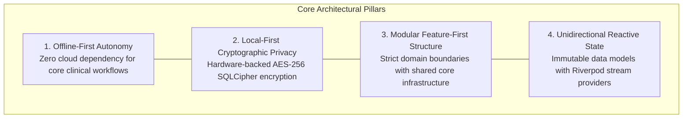

# ClinicPilot — Architecture Documentation Hub

Welcome to the technical architecture documentation for **ClinicPilot**, an enterprise-grade, offline-first clinical practice management and electronic medical records (EMR) system tailored for homeopathic physicians, polyclinics, and healthcare practitioners.

---

## 1. Documentation Index

The architecture of ClinicPilot is documented across four deep-dive technical specifications:

| Document | Focus & Scope | Key Topics |
| :--- | :--- | :--- |
| [**Architecture Overview**](./architecture-overview.md) | High-level system architecture, tiers, and data flows | Layered architecture, Riverpod 2.x reactive state, GoRouter navigation, storage tiering (SQLCipher + Drift + Hive), adaptive UI. |
| [**Data Model & Relational Schema**](./data-model.md) | Database tables, indexing, migrations, and storage layout | 15 Drift tables (Schema v18), multi-clinic tenancy, financial models, inventory posology, index design, dynamic JSON case storage, versioned migrations. |
| [**Clinical Case Engine**](./clinical-case-engine.md) | Specialized 17-section homeopathic case taking engine | LSRS symptom framework, mental/physical generals, miasmatic triage, Kent/Boenninghausen synthesis, posology scales, Hering's Law follow-up evaluation. |
| [**Quality Gates & Testing Strategy**](./quality-gates.md) | Quality enforcement, static analysis, and build verification | Zero-hardcoded colors rule, AST theme compliance test, Drift schema migration tests, serialization resilience, CI/CD release criteria. |

---

## 2. Core Architectural Philosophy

ClinicPilot's software architecture is governed by four non-negotiable architectural tenets designed to solve the harsh operating realities of solo medical practitioners and small clinics in emerging markets and high-pressure clinical environments:

### 2.1 Offline-First Autonomy
Medical consultations cannot be held hostage by intermittent 4G/5G connections, broadband outages, or cloud infrastructure downtime.
- **Zero Latency**: Every patient lookup, prescription generation, inventory decrement, and billing transaction completes in sub-millisecond local SQLite execution.
- **Complete Feature Parity Offline**: Case taking, repertorization, prescription printing, and financial accounting function with 100% capability without internet connectivity.
- **Optional, Decoupled Cloud Sync**: Encrypted backup and Google Drive sync occur as asynchronous, background workers (`PeriodicBackupRunner`, `CloudAutoSyncRunner`) that never block the UI thread or stall clinical operations.

### 2.2 Local-First Cryptographic Privacy
Protected Health Information (PHI) demands uncompromising security guarantees:
- **Zero Telemetry Leaks**: Clinical symptom narratives, patient identities, and billing figures are never transmitted to third-party telemetry or analytical servers.
- **Hardware-Enforced Encryption at Rest**: The entire SQLite database file is encrypted on-disk using **SQLCipher AES-256-CBC**.
- **Secure Key Derivation**: The 256-bit database encryption key is generated using platform cryptographically secure random number generators (`Random.secure()`) and stored in hardware-isolated enclaves:
  - **Android**: Android KeyStore (hardware TEE/StrongBox).
  - **iOS**: Apple Keychain Services (Secure Enclave).
  - **Windows/Desktop**: Data Protection API (DPAPI) via `flutter_secure_storage`.

### 2.3 Modular Feature-First Architecture
The codebase strictly decouples reusable horizontal infrastructure from vertical business domains:
- `lib/core/`: Contains the database engine, design system tokens, routing infrastructure, encryption services, and hardware integrations.
- `lib/features/`: Implements autonomous functional modules:
  - `clinical/`: 17-section case sheet, repertory synthesis, prescription posology, investigation tracking.
  - `patients/`: Demographic records, clinic register serial numbering, recall lists, footfalls.
  - `clinics/`: Multi-clinic tenancy configuration, operating schedules, GSTIN credentials.
  - `cashmemo/` & `finances/`: Invoicing, GST tax splits (CGST/SGST), partial payments, expense accounting.
  - `inventory/`: Dispensary stock, decimal/centesimal/LM dilutions, reorder thresholds, barcode scanning.
  - `growth/`: Practice analytics, camp conversions, disease distribution, referral CRM.
  - `security/`: Biometric app locking, PIN protection, session lifecycle timeouts.

### 2.4 Unidirectional Reactive State Flow
ClinicPilot enforces predictable, unidirectional data flows utilizing **Riverpod 2.x**:
- **Single Source of Truth**: The local Drift SQLite database represents the authoritative clinical reality.
- **Reactive Streams**: Database queries emit continuous Dart `Stream`s via Drift's query watcher machinery (`watch()`, `watchSingleOrNull()`).
- **Functional State Transformations**: Riverpod `StreamProvider`s and `StateNotifier`s listen to database mutations, map raw database entities to immutable domain models, and notify the presentation layer with zero manual polling.
- **Predictable UI Binding**: Flutter widgets consume state declaratively through `ref.watch()`, rebuilding only when underlying domain slices change.

---

## 3. Technology Stack Reference

| Tier | Component | Technology / Library | Version / Standard |
| :--- | :--- | :--- | :--- |
| **Framework** | Application Engine | Flutter / Dart SDK | Flutter 3.x / Dart 3.x |
| **State Management** | State & Dependency Injection | Flutter Riverpod | Riverpod 2.x (`StateNotifier`, `StreamProvider`) |
| **Navigation** | Declarative Router | GoRouter | StatefulShellRoute (Tabbed IndexedStack) |
| **Relational Database** | Local Persistence ORM | Drift (formerly Moor) | Drift SQLite (Schema v18) |
| **Database Encryption** | Transparent Page Encryption | SQLCipher / `sqlcipher_flutter_libs` | 256-bit AES-CBC with PBKDF2 key derivation |
| **Key-Value Store** | Fast Session & Settings Cache | Hive Flutter (`hive_flutter`) | Microsecond binary storage |
| **Key Storage** | Hardware Security Storage | Flutter Secure Storage | Android KeyStore / iOS Keychain / DPAPI |
| **Design System** | UI Components & Tokens | Material 3 + Custom Tokens | Strict AST-enforced zero hardcoded colors |
| **Document Generation** | Printing & Sharing | `pdf` / `printing` | Custom vector rendering for prescriptions & invoices |

---

## 4. Key Cross-References & ADRs

- [**ADR-004: Dynamic JSON Lineage & Backward-Compatible Case Record Architecture**](../decisions/ADR-004-case-record-synthesis.md)
- [**Product Manual: Homeopathic Clinical Scope & Posology**](../product/homeopathic-clinical-scope.md)
- [**Product Index & Architecture Vision**](../product/README.md)
