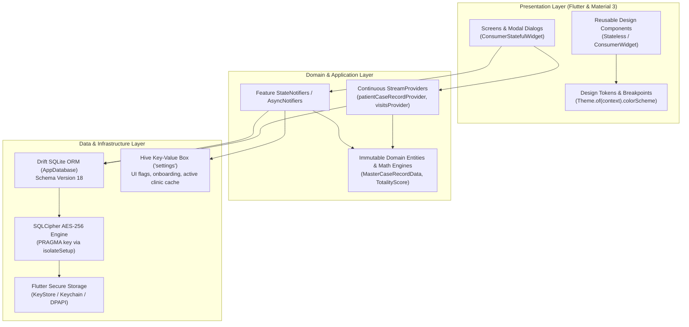
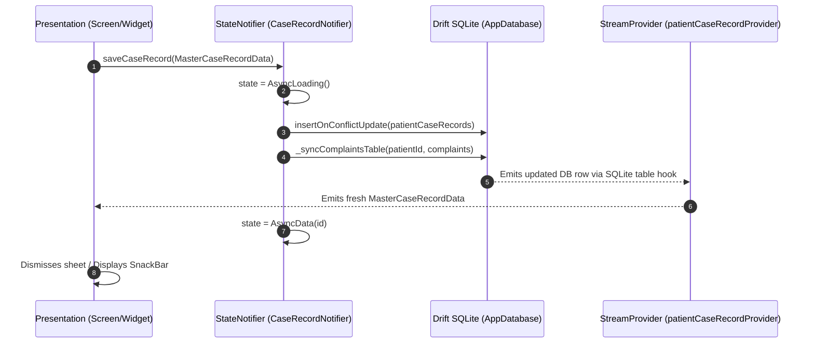
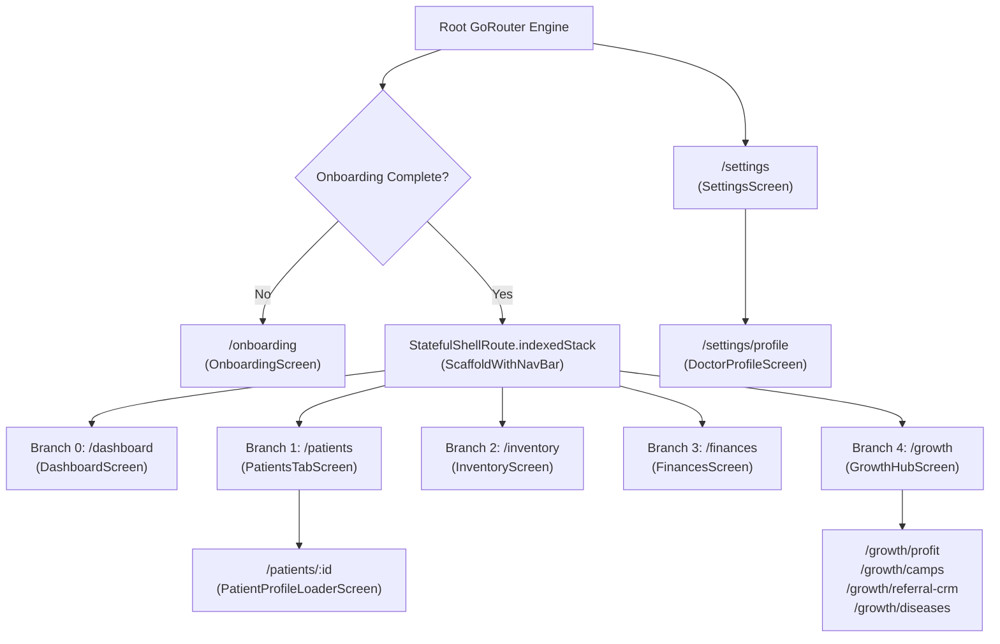
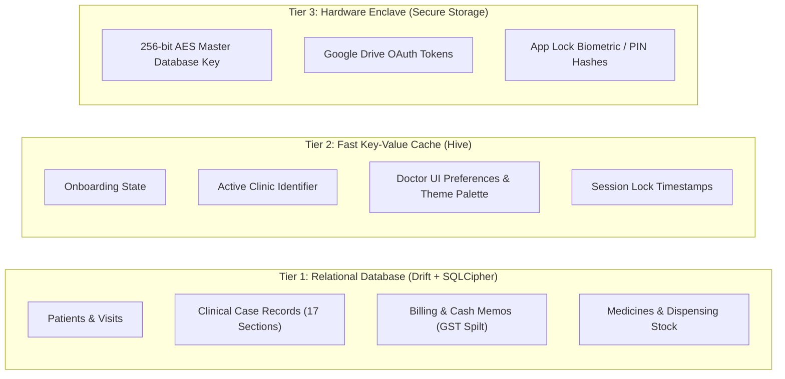
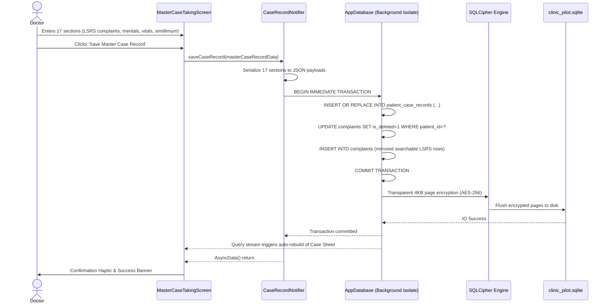

# ClinicPilot — Architecture Overview

> **Technical Architecture Specification: Layered Architecture, Reactive State Flow, Navigation Topologies & Storage Tiering**

---

## 1. System Context & Layered Topology

ClinicPilot is built upon a strict, unidirectional, decoupled 3-tier architecture. High cohesion and low coupling are maintained across all vertical feature modules:



### 1.1 The Presentation Layer
- **Component Architecture**: Built exclusively using Flutter Material 3 widgets with strict dynamic palette resolution.
- **State Consumption**: Screen widgets extend `ConsumerWidget` or `ConsumerStatefulWidget`. UI components declare fine-grained reactivity using `ref.watch(provider.select((s) => s.relevantField))`, avoiding expensive entire-tree rebuilds.
- **Responsive Layout Execution**: Breakpoint detection via `context.isTablet` dynamically pivots navigation between a mobile bottom bar (`FloatingBottomNavBar`) and a desktop/tablet sidebar (`NavigationRail`), adjusting content containers via `ResponsiveContent`.
- **Zero Color Leakage**: No static `Color(0xFF...)` or `Colors.blue` instances are permitted in feature widgets; colors resolve dynamically from `Theme.of(context).colorScheme` to support instant switching between clinical themes (Emerald, Teal, Monochrome).

### 1.2 The Domain & Application Layer
- **Pure Business Logic**: Clinical calculation engines (e.g. repertory scoring, GST intra-state split calculations, BMI derivation, Hering's law direction validation) reside in pure Dart classes independent of Flutter UI dependencies.
- **Immutable Domain Models**: Domain entities (e.g. `MasterCaseRecordData`, `ChiefComplaintDetail`, `CashMemoCompanion`) enforce value immutability and provide copy-with transformations and resilient deserialization.
- **State Control**: Application flows are orchestrated by Riverpod `StateNotifier` and `AsyncNotifier` controllers which encapsulate database transactions and emit asynchronous lifecycle states (`AsyncLoading`, `AsyncData`, `AsyncError`).

### 1.3 The Data & Infrastructure Layer
- **Relational Integrity (Drift)**: All clinical encounters, patient records, financial memos, inventory items, and clinics are managed via Drift tables compiling to optimized SQLite SQL.
- **Cryptographic Encryption**: Zero unencrypted data resides on flash memory. The SQLite database is transparently encrypted at the page level via SQLCipher.
- **Fast Key-Value Storage (Hive)**: Lightweight configuration primitives, session toggles, and onboarding flags are stored in binary Hive boxes for sub-millisecond synchronous reads.

---

## 2. State Management Architecture: Riverpod 2.x

ClinicPilot employs **Flutter Riverpod 2.x** for dependency injection, asynchronous data binding, and unidirectional state propagation.



### 2.1 Provider Taxonomies and Lifecycles

| Provider Type | Usage Pattern | Lifecycle Scope | Example from Codebase |
| :--- | :--- | :--- | :--- |
| `Provider<T>` | Read-only dependency injection and service singletons. | Global / App lifetime | `databaseProvider`, `routerProvider`, `cloudStorageRegistryProvider` |
| `StreamProvider.family<T, P>` | Continuous, live query bindings parameterised by entity ID (e.g., patient ID). Emits automatically when underlying SQLite tables mutate. | Auto-disposed / Cached | `patientCaseRecordProvider(patientId)`, `visitsForPatientProvider(patientId)` |
| `StateNotifierProvider<Notifier, AsyncValue<T>>` | Encapsulates write mutations, async boundaries, and business rule enforcement. | Screen / Feature lifetime | `caseRecordNotifierProvider`, `patientNotifierProvider`, `cashMemoNotifierProvider` |
| `StateProvider<T>` | Ephemeral UI filters, date-range selectors, and active tab index. | Contextual / Feature | `activeClinicIdProvider`, `selectedPeriodProvider`, `themeProvider` |

### 2.2 Active Clinic Tenancy Scoping
ClinicPilot supports multi-clinic practices (e.g. Morning Clinic in City Center vs. Evening Clinic in Suburbs). The active clinic context is maintained globally:

```dart
// lib/core/providers/clinic_provider.dart
final activeClinicIdProvider = StateProvider<String>((ref) {
  // Synchronously seed from Hive settings box, fallback to default seed
  final box = Hive.box('settings');
  return box.get('active_clinic_id', defaultValue: 'clinic_old') as String;
});
```

Downstream analytics, financial summaries, and inventory stock automatically re-scope when the doctor toggles the active clinic in the app bar `ClinicSwitcher`:
- `todayRevenueProvider` watches `activeClinicIdProvider`.
- Changing the clinic invalidates dependent database query caches and recalculates figures immediately.

---

## 3. Routing & Navigation Architecture: GoRouter

Application routing is declared centrally in [`lib/core/router/app_router.dart`](file:///d:/my-quests/side-projects/ClinicPilot/lib/core/router/app_router.dart) utilizing **GoRouter 14.x**.



### 3.1 Stateful IndexedStack Shell
The primary user interface operates within a `StatefulShellRoute.indexedStack`. This architecture guarantees:
1. **Preserved Scroll & Form State**: Switching between the *Patients* search tab and the *Finances* cash memo tab preserves partially entered data and scroll positions without reloading.
2. **Sub-Branch Deep Navigation**: Selecting secondary features inside the *Growth Hub* (e.g. `/growth/camps`, `/growth/profit`, `/growth/referral-crm`) stacks routes cleanly on top of the tab branch.
3. **Adaptive Shell Rendering**:
   - On screens `< 768px` (Mobile), the shell renders a `FloatingBottomNavBar`.
   - On screens `≥ 768px` (Tablet/Desktop), the shell renders an expanded `NavigationRail` alongside `ResponsiveContent`.

### 3.2 Asynchronous Route Guards
First-run execution is protected by an asynchronous redirect guard listening to `onboardingCompleteProvider`:
```dart
redirect: (context, state) {
  final done = ref.read(onboardingCompleteProvider).value ?? isDone;
  if (!done && state.matchedLocation != '/onboarding') return '/onboarding';
  if (done && state.matchedLocation == '/onboarding') return '/dashboard';
  return null;
}
```
A custom `_ProviderRefresh` listenable bridges Riverpod's reactive stream to GoRouter's `refreshListenable`, triggering instant redirection once onboarding persistence finishes.

---

## 4. Storage Tiering & Cryptographic Architecture

ClinicPilot partitions data into three distinct storage tiers according to access frequency, transactional guarantees, and privacy sensitivity:



### 4.1 Tier 1: Relational SQLite with SQLCipher
- **Engine**: Drift SQLite ORM over `sqlite3` using `sqlcipher_flutter_libs`.
- **Concurrency**: Operates asynchronously in a dedicated Dart background worker isolate via `NativeDatabase.createInBackground(file, isolateSetup: ...)`. Heavy analytical aggregations never introduce jank into UI animations.
- **SQLCipher Verification**: During connection establishment in `lib/core/database/connection/native.dart`, the engine executes `PRAGMA cipher_version;`. If SQLCipher native binaries are not verified, execution throws an explicit `StateError`, preventing unencrypted data writes.
- **Key Injection**: The raw database handle is unlocked via `PRAGMA key = '$key';` immediately before any DDL or migration statement executes.

### 4.2 Tier 2: Microsecond Key-Value Cache (Hive)
- **Engine**: `hive_flutter` storing binary boxes in the local app documents directory.
- **Purpose**: Low-latency synchronous lookups during application boot before the relational database opens.
- **Stored Entities**:
  - `kOnboardingDoneKey`: Boolean determining whether to route to `/onboarding`.
  - `active_clinic_id`: Default clinic identifier.
  - `selected_palette`: Emerald, Teal, or Monochrome theme selection.

### 4.3 Tier 3: Hardware Key Storage (Flutter Secure Storage)
- **Engine**: Hardware Keystore integration (`flutter_secure_storage`).
- **Cryptographic Guarantees**:
  - The database master key is a 32-byte (256-bit) cryptographically strong random token generated via `Random.secure()`, encoded in base64 URL format.
  - Stored under key `clinicpilot_db_encryption_key`.
  - Non-exportable, hardware-isolated on Android (TEE/StrongBox) and iOS (Secure Enclave).

---

## 5. End-to-End Clinical Data Flow

The following diagram illustrates the complete round-trip flow of data when a physician records a comprehensive clinical case:


