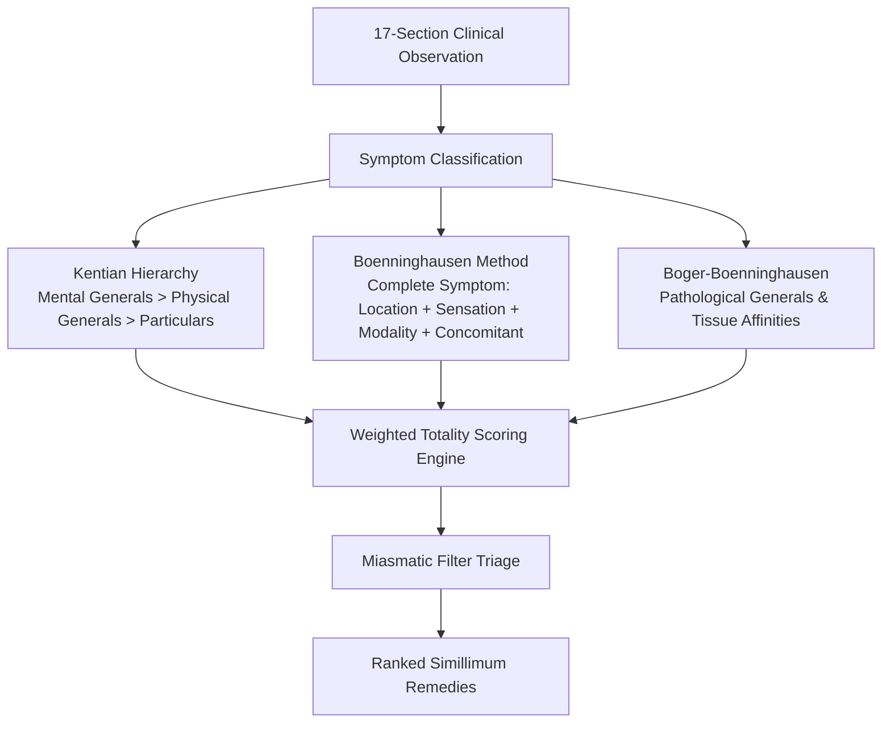
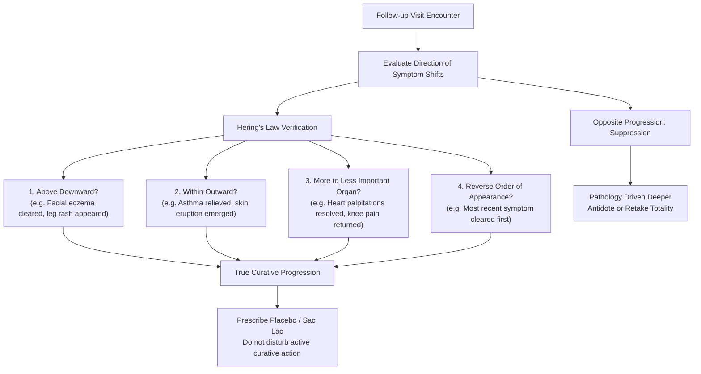

# ClinicPilot — Clinical Case Engine & Homeopathic Synthesis

> **Clinical Architecture Manual: The 17-Section Case Taking Engine, Posology Models, Totality Synthesis & Direction of Cure**

---

## 1. The Homeopathic Clinical Paradigm

Classical homeopathy treats the diseased human individual rather than an isolated diagnosis. Under the foundational canon of Samuel Hahnemann's *Organon of Medicine* (§153), curative prescription relies upon discovering the **Simillimum**—the single dynamized medicinal substance whose experimental provings in healthy humans most closely mirror the totality of the patient's characteristic symptoms (*Similia Similibus Curentur*).

To capture this totality without data fragmentation, ClinicPilot implements a comprehensive **17-Section Clinical Case Engine**:

```mermaid
graph TD
    subgraph "17-Section Homeopathic Case Taking Architecture"
        S1["1. Patient Identification & Social Profile"]
        S2["2. Chief Complaints (LSRS Framework)"]
        S3["3. History of Present Illness (HPI)"]
        S4["4. Past Medical & Surgical History"]
        S5["5. Family Medical History & Diathesis"]
        S6["6. Intrauterine, Birth & Development"]
        S7["7. Physical Generals (Thermals, Desires, Sleep)"]
        S8["8. Mental Generals & Emotional Disposition"]
        S9["9. Personal, Lifestyle & Social History"]
        S10["10. General Physical & Systemic Exam"]
        S11["11. Miasmatic Analysis & Triage"]
        S12["12. Case Analysis & Repertorial Totality"]
        S13["13. Clinical Assessment & Diagnosis"]
        S14["14. Baseline Prescription & Posology"]
        S15["15. Investigations & Diagnostic Tracking"]
        S16["16. Longitudinal Follow-Up & Progression"]
        S17["17. Clinical Outcome & Prognostic Status"]
    end

    S1 --> S2 --> S3 --> S4 --> S5 --> S6
    S6 --> S7 --> S8 --> S9 --> S10 --> S11
    S11 --> S12 --> S13 --> S14 --> S15 --> S16 --> S17
```

---

## 2. Structure of the 17 Clinical Sections

Each clinical dimension is represented by dedicated, strongly-typed domain models located in [`lib/features/clinical/models/case_record_models.dart`](file:///d:/my-quests/side-projects/ClinicPilot/lib/features/clinical/models/case_record_models.dart).

### 2.1 Section 1: Patient Identification & Demographics (`PatientIdentificationDetails`)
Captures administrative context: registration serial number (`regNo`), date of first visit, name, age, biological gender, date of birth, occupation, residential address, contact number, and marital status.

### 2.2 Section 2: Chief Complaints (`ChiefComplaintDetail`)
Structured according to the classical **LSRS Framework**:
- **Location & Extension**: Specific anatomical tissue affected and radiation vectors (`location`, `extensionRadiation`).
- **Sensation**: Qualitative nature of discomfort (e.g. *burning*, *stitching*, *throbbing*, *numbness*).
- **Modalities**: Factors that worsen or relieve the symptom:
  - Aggravations (`modalitiesAgg`): e.g. *worse 3 AM, cold air, movement*.
  - Ameliorations (`modalitiesAmel`): e.g. *better warm drinks, pressure, lying on affected side*.
- **Concomitants**: Symptoms that appear synchronously with the complaint without pathological relation (`concomitants`).
- **Causation & Dynamics**: Aetiological factors (`causation`), periodicity, onset time, and severity rating.

### 2.3 Section 3: History of Present Illness (`HpiDetails`)
Traces the chronological evolution of the present complaint: initial onset, progression timeline, preceding medical treatments, physiological responses to previous therapies, and precipitating environmental or emotional triggers.

### 2.4 Section 4: Past Medical History (`PastHistoryDetails`)
Chronicles historical illnesses with special attention to **suppressed pathologies**:
- Childhood illnesses: eruptive fevers (measles, mumps, varicella).
- Chronic medical conditions and hospitalizations.
- Major surgeries and trauma (`PastDiseaseEntry`).
- Historical allopathic and prior homeopathic treatments (vital for identifying antidoted or drug-suppressed miasms).

### 2.5 Section 5: Family Medical History (`FamilyHistoryDetails`)
Evaluates hereditary diathesis across three familial generations: paternal line, maternal line, and immediate family (siblings, spouse, children). Tracks familial incidence of diabetes, cancer, tuberculosis, autoimmune diseases, and psychiatric disorders.

### 2.6 Section 6: Intrauterine & Developmental History (`DevelopmentalHistoryDetails`)
Crucial for pediatric and constitutional cases:
- Maternal physical and emotional health during gestation.
- Gestational age, birth weight, and delivery complications (caesarean vs vaginal).
- Neonatal history, infant breastfeeding duration.
- Chronological milestones: dentition, walking, speech acquisition.

### 2.7 Section 7: Physical Generals (`PhysicalGenerals`)
Constitutional reactions of the organism as an integrated biological whole:
- **Thermals (`thermal`)**: Reaction to atmospheric temperatures (*Ambithermal*, *Chilly* [wants warmth], *Hot* [wants cold air/cooling]).
- **Alimentary**: Thirst frequency and volume, appetite, hunger dynamics during fasting, specific food cravings (salt, sweet, fats, sour, spicy), food aversions, and gastrointestinal intolerances.
- **Excretions & Discharges**: Stool character and difficulties, urinary symptoms, perspiration distribution and odor.
- **Sleep & Dreams**: Preferred sleeping position, onset latency, nocturnal disturbances, recurrent or vivid dreams.
- **Reproductive & Hormonal**: Menstrual rhythm, flow character, and obstetric history.

### 2.8 Section 8: Mental Generals (`MentalGenerals`)
The highest-ranked hierarchy in Kentian case analysis (§210–§230 of *Organon*):
- General disposition, irritability, temper, and grief reactions.
- Anxieties, dreads, and specific phobias (heights, dark, storms, illness, animals).
- Social orientation: desire for company versus desire for solitude.
- Consolation response: ameliorated by consolation vs aggravated/irritated by comforting.
- Intellect & Will: confidence, memory, concentration, reaction to reprimand, response to contradiction.

### 2.9 Section 9: Personal & Lifestyle History (`LifestyleHistoryDetails`)
Evaluates daily maintaining causes (*causa occasionalis*): dietary habits, caffeine/tobacco/alcohol usage, physical activity levels, occupational posture, sleep routines, and domestic or financial stressors.

### 2.10 Section 10: Clinical Examination & Vitals (`ClinicalExamVitals`)
Integrates clinical observation with objective examination:
- General physical appearance, nutritional build, pallor, icterus, cyanosis, clubbing, lymphadenopathy, and peripheral edema.
- Objective vitals: blood pressure, pulse, respiratory rate, body temperature, $\text{SpO}_2$, height, weight, and derived BMI.
- Systemic physical examination: Cardiovascular (CVS), Respiratory, Abdomen, Central Nervous System (CNS), Musculoskeletal, and Dermatological.
- Interactive Dental Chart integration (`dentalChartJson`).

### 2.11 Section 11: Miasmatic Analysis (`MiasmaticAnalysis`)
Triages constitutional pathology according to Hahnemann's theory of chronic miasms:
- **Psora**: Functional disturbances, hypersensitivity, deficiency, pruritus.
- **Sycosis**: Excessive tissue proliferation, overgrowth, retention, catarrh.
- **Syphilis**: Degeneration, tissue destruction, ulceration, structural loss.
- **Tubercular**: Rapid wasting, respiratory weakness, alternating symptom states.
- Identifies dominant vs secondary mixed miasmatic dominance.

### 2.12 Section 12: Case Totality & Repertorization (`CaseTotality`)
Synthesizes the totality of symptoms into ranked repertory rubrics:
- General symptom synthesis (Mentals + Physical Generals).
- Repertory engine selection (Kent, Boenninghausen, Boger).
- Candidate differential remedies and final selected Simillimum with clinical justification.

### 2.13 Section 13: Clinical Assessment & Diagnosis (`ClinicalAssessmentDetails`)
Formulates formal medical diagnoses: provisional diagnosis, differential diagnosis, confirmed working diagnosis, comorbidities, and red flag warnings requiring emergency referral.

### 2.14 Section 14: Baseline Prescription & Posology (`PrescriptionPlanDetails`)
Specifies the complete medicinal posology: remedy name, potency scale, dose quantity, repetition frequency, administration vehicle, dietary restrictions, and prescribing rationale.

### 2.15 Section 15: Investigations & Laboratory Orders (`InvestigationsPlanDetails`)
Tracks pathology markers (blood chemistry, hormone panels, microbiology) and diagnostic imaging reports with attachment reference tracking.

### 2.16 Section 16: Longitudinal Follow-Up Progression (`FollowUpDetails`)
Tracks patient response over elapsed visit intervals: changes in chief complaints, emergence of new symptoms, sleep/appetite shifts, and direction of cure evaluation.

### 2.17 Section 17: Clinical Outcome (`OutcomeDetails`)
Records longitudinal status: active treatment, curative resolution, symptom palliation, or loss to follow-up.

---

## 3. Repertorization & Totality Synthesis Algorithms

ClinicPilot implements a multi-methodology repertorial scoring engine capable of switching between classical repertory models:

### 3.1 Mathematical Scoring Formulation
When rubrics are assembled from the patient's case, candidate remedies are ranked using a multi-variable scoring equation:

$$\text{Score}(R) = w_c \cdot C(R) + \sum_{i=1}^{N} G(R, r_i) \cdot H(r_i)$$

Where:
- $C(R)$ is the total count of selected rubrics covered by remedy $R$.
- $G(R, r_i) \in \{1, 2, 3, 4\}$ represents the classical provings grade of remedy $R$ in rubric $r_i$.
- $H(r_i)$ is the hierarchical weight assigned to rubric category $r_i$:
  - $\text{Mental Generals}: H(r_i) = 1.5$
  - $\text{Physical Generals / Thermals}: H(r_i) = 1.3$
  - $\text{Particulars / Modalities}: H(r_i) = 1.0$
- $w_c$ is the coverage priority scalar ensuring comprehensive coverage outweighs isolated high-grade rubrics.

---

## 4. Potency Scales & Posology Architecture

The prescription engine natively models three distinct pharmaceutical dynamization scales:

| Scale | Dilution Ratio | Standard Potencies | Primary Indication & Repetition |
| :--- | :--- | :--- | :--- |
| **Centesimal (C / CH)** | $1:100$ | `6C`, `30C`, `200C`, `1M`, `10M`, `50M`, `CM` | Acute states (`30C`), initial constitutional taking (`200C`), deep psychological cases (`1M+`). Single dose or infrequent repetition. |
| **Decimal (X / D / DH)** | $1:10$ | `1X`, `3X`, `6X`, `12X`, `30X` | Biochemic Cell Salts (Schüssler) and solid mineral triturations. Frequent daily repetition (TDS/QID). |
| **50-Millesimal (LM / Q)** | $1:50,000$ | `LM 0/1` to `LM 0/30` | Advanced chronic pathology, hypersensitive patients. Daily liquid succussed doses with minimal therapeutic aggravation. |

---

## 5. Longitudinal Follow-Up & Hering's Law of Cure

ClinicPilot structures follow-up visits around **Hering's Law of Cure** and Kent's Twelve Observations to guide physicians on whether to maintain placebo, repeat, change potency, or antidote:

### 5.1 Kent's Observations Matrix in ClinicPilot

| Follow-Up Clinical Observation | Pathological Interpretation | Recommended Clinical Action |
| :--- | :--- | :--- |
| **Short, sharp aggravation followed by prolonged improvement** | Accurate simillimum prescribed; patient vitality is robust. | **Wait & Watch**: Dispense Placebo (*Sac Lac*). Do not repeat. |
| **Prolonged aggravation with slow, gradual recovery** | Remedy was accurate, but potency was excessively high or tissue pathology is deep. | **Observe closely**: Do not repeat; next time select LM or lower potency. |
| **Prolonged aggravation with progressive vital decline** | Remedy was an excessively deep anti-miasmatic given in advanced structural incurable disease. | **Antidote immediately**: Administer low-potency palliative or indicated antidote. |
| **Amelioration followed immediately by relapse** | Remedy was merely superficial or partial palliative; or strong maintaining cause exists. | **Re-case taking**: Find deeper constitutional Simillimum or eliminate obstacle to cure. |
| **Old symptoms reappear in reverse chronological order** | Healing is progressing strictly along **Hering's Law**. Ideal curative reaction. | **Placebo**: Never interfere with returning historical symptoms. |
| **Entirely new symptoms emerge after prescription** | Remedy was erroneous; proving of the unindicated remedy is occurring. | **Antidote or Re-prescribe**: Retake totality incorporating the new symptoms. |
