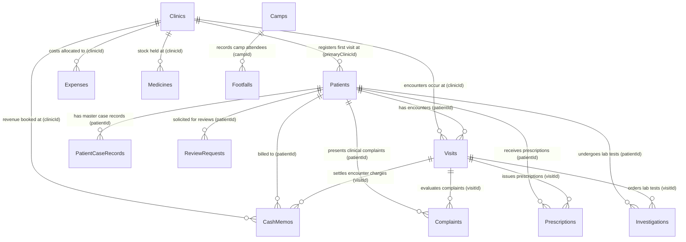
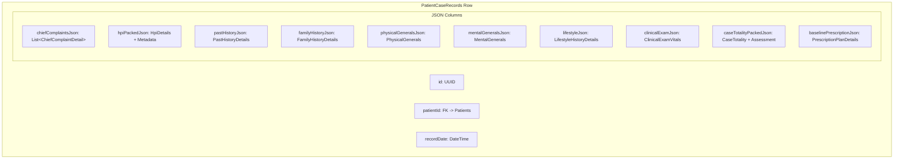
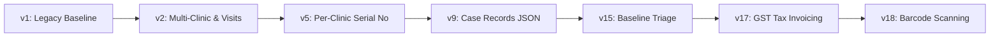

# ClinicPilot — Data Model & Relational Schema

> **Technical Database Specification: Drift ORM, Relational Tables, Indexing Strategy, Dynamic JSON Schemas & Migration Paths (Schema Version 18)**

---

## 1. Relational Entity-Relationship Model

The ClinicPilot operational database is defined via Drift ORM across 15 relational tables, anchored by multi-clinic tenancy and patient identity:



### 1.1 Referential Integrity Enforcement
Drift enables strict relational foreign key enforcement inside `app_database.dart`:
```dart
beforeOpen: (details) async {
  await customStatement('PRAGMA foreign_keys = ON');
  // ...
}
```
If a parent entity (e.g., `Patient`) is soft-deleted, child records remain associated with referential integrity preserved for retrospective financial reporting and medical audit compliance.

---

## 2. Table Specifications & Schema Definitions

### 2.1 `Clinics` (Practice Tenancy & Clinic Infrastructure)
Models the physical practice locations operated by the physician. Every clinical encounter, revenue entry, and expenditure is scoped to a clinic.

| Column | Type | Constraints | Description |
| :--- | :--- | :--- | :--- |
| `id` | `TEXT` | `PRIMARY KEY` | Unique clinic identifier (`clinic_old`, `clinic_new`, UUID). |
| `name` | `TEXT` | `NOT NULL` | Practice display name (e.g. "CureWell Homeopathy"). |
| `address` | `TEXT` | `NULL` | Physical street address printed on invoices and letterheads. |
| `phone` | `TEXT` | `NULL` | Practice phone number for patient receipts. |
| `monthlyRent` | `REAL` | `DEFAULT 0.0` | Fixed monthly rent. Powers true clinic-level net profit analytics without requiring recurring manual expense entries. |
| `defaultConsultationFee` | `REAL` | `DEFAULT 0.0` | Pre-fills the consultation fee field in Cash Memo generation. |
| `openDays` | `TEXT` | `DEFAULT '1,2,3,4,5,6'` | Comma-separated ISO day integers (Mon=1..Sun=7). Powers "average patients per operational clinic day". |
| `gstin` | `TEXT` | `NULL` | GST Identification Number. If non-null, the practice is registered for GST and generates statutory tax invoices. |
| `defaultGstRate` | `REAL` | `NULL` | Fallback GST percentage (e.g., `12.0`) for dispensed items without an itemized tax slab. |
| `colorHex` | `TEXT` | `DEFAULT '#0F5132'` | Visual branding accent used in clinic switcher indicators. |
| `isActive` | `INTEGER` | `DEFAULT 1` | Active operational status flag. |
| `isDeleted` | `INTEGER` | `DEFAULT 0` | Soft-deletion flag. |
| `createdAt` | `INTEGER` | `DEFAULT CURRENT_TIMESTAMP`| Creation timestamp. |

---

### 2.2 `Patients` (Patient Demographics & Identifiers)
Represents the patient identity. Decouples the human identity from specific clinic encounters while retaining registration origin.

| Column | Type | Constraints | Description |
| :--- | :--- | :--- | :--- |
| `id` | `TEXT` | `PRIMARY KEY` | Cryptographically random UUID. |
| `patientCode` | `TEXT` | `DEFAULT ''` | Auto-generated sequential code shown in UI (e.g. `P-2026-00042`). |
| `serialNo` | `TEXT` | `DEFAULT ''` | Manual register number written on paper files. Unique per clinic via explicit unique composite index `idx_patients_clinic_serial`. |
| `name` | `TEXT` | `NOT NULL` | Full patient name. |
| `phone` | `TEXT` | `NOT NULL` | Primary mobile number; indexed for sub-millisecond search. |
| `whatsapp` | `TEXT` | `NULL` | WhatsApp messaging number for prescriptions and recalls. |
| `email` | `TEXT` | `NULL` | Email address for digital invoices and communications. |
| `age` | `INTEGER` | `NOT NULL` | Age in years at registration. |
| `gender` | `TEXT` | `NOT NULL` | Gender (`Male`, `Female`, `Other`). |
| `area` | `TEXT` | `NULL` | Locality / neighborhood for hyperlocal practice growth mapping. |
| `address` | `TEXT` | `NULL` | Detailed postal address. |
| `occupation` | `TEXT` | `NULL` | Patient occupation; vital for occupational toxicity analysis. |
| `primaryClinicId` | `TEXT` | `DEFAULT 'clinic_old'` | Clinic where the patient first registered. Used strictly for cohort origin, **never** for revenue attribution. |
| `primaryDisease` | `TEXT` | `NULL` | Denormalized baseline disease from first visit for high-speed list views. |
| `referralSource` | `TEXT` | `NULL` | How the patient found the clinic (e.g. `Word of mouth`, `Camp`, `Google`). |
| `notes` | `TEXT` | `NULL` | General non-clinical administrative remarks. |
| `reviewAskedAt` | `INTEGER` | `NULL` | Timestamp when a Google Review was requested. |
| `reviewGiven` | `INTEGER` | `DEFAULT 0` | Boolean indicator whether the patient confirmed posting a review. |
| `isDeleted` | `INTEGER` | `DEFAULT 0` | Soft-deletion flag. |
| `createdAt` | `INTEGER` | `DEFAULT CURRENT_TIMESTAMP`| Registration timestamp. |
| `updatedAt` | `INTEGER` | `DEFAULT CURRENT_TIMESTAMP`| Last update timestamp. |

---

### 2.3 `Visits` (Clinical Encounters & Recall Tracking)
Records every physical, online, or camp encounter between a patient and the clinic.

| Column | Type | Constraints | Description |
| :--- | :--- | :--- | :--- |
| `id` | `TEXT` | `PRIMARY KEY` | Encounter UUID. |
| `patientId` | `TEXT` | `REFERENCES Patients(id)` | Associated patient. |
| `clinicId` | `TEXT` | `REFERENCES Clinics(id)` | **Authoritative clinic for revenue and footfall attribution.** |
| `visitType` | `TEXT` | `NOT NULL` | `'new'` (patient's first visit ever) or `'repeat'`. Stored at insert time. |
| `consultationType`| `TEXT` | `DEFAULT 'clinic'` | Modality: `'clinic'`, `'online'`, `'camp'`. |
| `disease` | `TEXT` | `NOT NULL` | Primary clinical condition diagnosed during this encounter. |
| `chiefComplaint` | `TEXT` | `NULL` | High-level summary of the chief symptom for quick glance. |
| `referralSource` | `TEXT` | `NULL` | Recorded exclusively on `visitType = 'new'`. |
| `outcome` | `TEXT` | `NULL` | Longitudinal status (`improved`, `no_change`, `worse`, `recovered`, `lost_followup`). |
| `visitDate` | `INTEGER` | `NOT NULL` | Actual clinical consultation date; indexed for daily/monthly ranges. |
| `nextFollowUpDate` | `INTEGER` | `NULL` | Target follow-up date; indexed for overdue recall queries. |
| `notes` | `TEXT` | `NULL` | Clinical progress notes. |
| `isDeleted` | `INTEGER` | `DEFAULT 0` | Soft-deletion flag. |
| `createdAt` | `INTEGER` | `DEFAULT CURRENT_TIMESTAMP`| Audit timestamp. |

---

### 2.4 `CashMemos` (Invoicing & Financial Ledger)
Manages practice billing, taxation, and partial payments.

| Column | Type | Constraints | Description |
| :--- | :--- | :--- | :--- |
| `id` | `TEXT` | `PRIMARY KEY` | Invoice UUID. |
| `memoNumber` | `TEXT` | `NOT NULL` | Statutory sequential receipt number (e.g. `CM-2026-00001`). |
| `patientId` | `TEXT` | `REFERENCES Patients(id)` | Billed patient. |
| `clinicId` | `TEXT` | `REFERENCES Clinics(id)` | Revenue-receiving clinic. |
| `visitId` | `TEXT` | `REFERENCES Visits(id) NULL`| Associated clinical visit. |
| `consultationFee`| `REAL` | `DEFAULT 0.0` | Fee charged for physician's consultation time. |
| `medicineFee` | `REAL` | `DEFAULT 0.0` | Charge for dispensed remedies. |
| `otherFee` | `REAL` | `DEFAULT 0.0` | Procedural or dressing charges. |
| `discount` | `REAL` | `DEFAULT 0.0` | Commercial concession deducted from gross. |
| `cgstAmount` | `REAL` | `NULL` | Central GST levied (50% of intra-state tax). |
| `sgstAmount` | `REAL` | `NULL` | State GST levied (50% of intra-state tax). |
| `gstin` | `TEXT` | `NULL` | Clinic GSTIN snapshot active at time of invoice creation. |
| `total` | `REAL` | `NOT NULL` | Final invoice amount: `(consult + med + other) - discount + cgst + sgst`. |
| `paidAmount` | `REAL` | `DEFAULT 0.0` | Amount collected at settlement; `pending = total - paidAmount`. |
| `paymentMethod` | `TEXT` | `NOT NULL` | Mode: `Cash`, `UPI`, `Card`, `Bank Transfer`. |
| `memoDate` | `INTEGER` | `DEFAULT CURRENT_TIMESTAMP`| **Authoritative reporting date** when payment moved. |
| `createdAt` | `INTEGER` | `DEFAULT CURRENT_TIMESTAMP`| Row write timestamp for audit trail. |
| `isDeleted` | `INTEGER` | `DEFAULT 0` | Soft-deletion flag. |

---

### 2.5 `Medicines` (Dispensary Inventory & Stock Ledger)
Manages homeopathic dilutions, mother tinctures, triturations, and dispensing materials.

| Column | Type | Constraints | Description |
| :--- | :--- | :--- | :--- |
| `id` | `TEXT` | `PRIMARY KEY` | Medicine UUID. |
| `name` | `TEXT` | `NOT NULL` | Remedial name (e.g. *Arnica Montana*, *Nux Vomica*). |
| `category` | `TEXT` | `NOT NULL` | `Dilution`, `Mother Tincture`, `Biochemic`, `Tablets/Capsules`, `Ointment/Syrup`, `Consumables`. |
| `potency` | `TEXT` | `NULL` | Homeopathic potency (`30C`, `200C`, `1M`, `Q`, `6X`, `LM 0/1`). |
| `form` | `TEXT` | `NULL` | Physical form: `Globules`, `Liquid`, `Tablets`, `Cream`, `Drops`, `Powder`. |
| `currentStock` | `REAL` | `DEFAULT 0.0` | Live balance in inventory. |
| `unit` | `TEXT` | `NOT NULL` | Package unit: `Bottles (30ml)`, `Vials`, `Strips`, `Drams`, `Tablets`. |
| `reorderLevel` | `REAL` | `DEFAULT 3.0` | Low-stock threshold triggering automated inventory alerts. |
| `costPrice` | `REAL` | `NULL` | Acquisition cost per unit. |
| `sellingPrice` | `REAL` | `NULL` | Retail dispensing charge per unit. |
| `gstRate` | `REAL` | `NULL` | Item-level tax slab (e.g., `5.0`, `12.0`). Null falls back to clinic default. |
| `batchNumber` | `TEXT` | `NULL` | Manufacturer batch number. |
| `barcode` | `TEXT` | `NULL` | GS1 / EAN-13 barcode printed on product pack for optical scanning. |
| `expiryDate` | `INTEGER` | `NULL` | Expiration date; triggers dispense warning if expired. |
| `clinicId` | `TEXT` | `REFERENCES Clinics(id) NULL`| Clinic dispensary where stock is located. |
| `isDeleted` | `INTEGER` | `DEFAULT 0` | Soft-deletion flag. |

---

### 2.6 `Expenses` (Practice Expenditures)
Captures operational costs categorized by overhead type and clinic allocation.

| Column | Type | Constraints | Description |
| :--- | :--- | :--- | :--- |
| `id` | `TEXT` | `PRIMARY KEY` | Expense UUID. |
| `clinicId` | `TEXT` | `REFERENCES Clinics(id)` | Attributed clinic location. |
| `category` | `TEXT` | `NOT NULL` | `Rent`, `Electricity`, `Staff Salary`, `Medicine Purchase`, `Marketing`, `Camp`, `Internet`, `Miscellaneous`. |
| `subcategory` | `TEXT` | `NULL` | Sub-category tag (e.g. camp name for camp ROI tracking). |
| `amount` | `REAL` | `NOT NULL` | Expenditure amount. |
| `paymentMethod` | `TEXT` | `DEFAULT 'Cash'` | Payment mode. |
| `isRecurring` | `INTEGER` | `DEFAULT 0` | Flag differentiating fixed overhead from variable expenses. |
| `date` | `INTEGER` | `NOT NULL` | Expense incurrence date; indexed for financial reporting. |
| `isDeleted` | `INTEGER` | `DEFAULT 0` | Soft-deletion flag. |

---

### 2.7 Other Specialized Tables

| Table Name | Primary Purpose | Key Fields & Relationships |
| :--- | :--- | :--- |
| **`PatientCaseRecords`** | Master 17-section homeopathic case record envelope. | `patientId` (FK), `recordDate`, `chiefComplaintsJson`, `hpi`, `pastHistoryJson`, `familyHistoryJson`, `physicalGeneralsJson`, `mentalGeneralsJson`, `lifestyleJson`, `clinicalExamJson`, `miasmaticAnalysisJson`, `caseTotalityJson`, `baselinePrescriptionJson`. |
| **`Complaints`** | Normalized active complaints mirror for rapid indexing. | `patientId` (FK), `visitId` (FK), `complaintName`, `location`, `sensation`, `aggravatingFactors`, `amelioratingFactors`, `severity` (1-10), `status` (Active, Improving, Resolved). |
| **`Prescriptions`** | Normalized active prescriptions mirror for dispensing. | `patientId` (FK), `visitId` (FK), `remedyName`, `potency`, `doseCount`, `frequency`, `vehicle`, `durationDays`. |
| **`Investigations`** | Diagnostic laboratory tests and attached reports. | `patientId` (FK), `visitId` (FK), `testCategory`, `testName`, `numericValue`, `unit`, `refRangeMin`, `refRangeMax`, `flag` (Normal, High, Low), `reportAttachments` (JSON list). |
| **`Camps`** | Community health screening camps. | `name`, `location`, `startDate`, `endDate`, `leadDoctor`, `budget`, `sponsor`. |
| **`Footfalls`** | Daily clinic walk-in traffic logging. | `clinicId` (FK), `date`, `totalFootfall`, `newEnquiries`, `campConversions`. |
| **`ReferralContacts`**| Medical specialist & practitioner CRM directory. | `name`, `specialty`, `phone`, `email`, `hospitalAffiliation`, `patientCount`. |
| **`ReviewRequests`** | Automated Google Review marketing pipeline. | `patientId` (FK), `clinicId` (FK), `requestedAt`, `status` (Sent, Opened, Completed). |
| **`Settings`** | Global key-value operational configuration. | `key` (PK), `value`, `updatedAt`. Keys include `monthly_revenue_goal`, `currency_symbol`. |

---

## 3. High-Performance Indexing Strategy

To guarantee **sub-millisecond query responses** on low-end Android mobile devices with thousands of patient records, ClinicPilot enforces explicit composite and covering B-Tree indices:

```sql
-- Encounters: Optimized for Dashboard daily lists, monthly ranges, and patient timelines
CREATE INDEX idx_visits_date ON visits (visit_date);
CREATE INDEX idx_visits_clinic_date ON visits (clinic_id, visit_date);
CREATE INDEX idx_visits_patient ON visits (patient_id);
CREATE INDEX idx_visits_type_date ON visits (visit_type, visit_date);
CREATE INDEX idx_visits_followup ON visits (next_follow_up_date);

-- Revenue & Ledger: Optimized for Cash Memo reporting and encounter joins
CREATE INDEX idx_memos_created ON cash_memos (created_at);
CREATE INDEX idx_memos_clinic_date ON cash_memos (clinic_id, created_at);
CREATE INDEX idx_memos_patient ON cash_memos (patient_id);
CREATE INDEX idx_memos_visit ON cash_memos (visit_id);

-- Operational Costs: Scoped financial calculations
CREATE INDEX idx_expenses_date ON expenses (date);
CREATE INDEX idx_expenses_clinic_date ON expenses (clinic_id, date);

-- Contact Lookups: Instant caller matching during registration
CREATE INDEX idx_patients_phone ON patients (phone);

-- Multi-Clinic Physical Register: Enforces per-clinic unique register serials
CREATE UNIQUE INDEX idx_patients_clinic_serial ON patients (primary_clinic_id, serial_no);
```

### 3.1 Architectural Rationale for `idx_patients_clinic_serial`
Doctors keep a physical paper register at each clinic location. Clinic A has its own Patient #1, and Clinic B has its own Patient #1. 
- Enforcing `UNIQUE(primary_clinic_id, serial_no)` guarantees strict clinic-level uniqueness without cross-clinic collision.
- Implemented as an explicit `CREATE UNIQUE INDEX` rather than a Drift table-level `uniqueKeys` declaration to prevent SQLite table rebuild locks during schema migrations.

---

## 4. Dynamic JSON Case Record Schema & Resilient Serialization

As established in [ADR-004](../decisions/ADR-004-case-record-synthesis.md), ClinicPilot combines a relational outer envelope with strongly-typed, version-resilient JSON payloads for complex homeopathic clinical data.



### 4.1 Schema Evolution & Fallback Parsing
When deserializing JSON payloads, domain models in `case_record_models.dart` apply defensive fallback cascades:
```dart
// Example: Resilient parsing in PhysicalGenerals
factory PhysicalGenerals.fromJson(Map<String, dynamic> json) {
  // Gracefully handle legacy combined fields vs modern split fields
  final rawStool = json['stool'] as String? ?? '';
  final stoolFreq = json['stoolFrequency'] as String? ?? '';
  final stoolCons = json['stoolConsistency'] as String? ?? '';
  String stoolVal = rawStool;
  if (stoolVal.isEmpty) {
    final parts = [stoolFreq, stoolCons].where((s) => s.isNotEmpty).toList();
    if (parts.isNotEmpty) stoolVal = parts.join(', ');
  }
  return PhysicalGenerals(
    thermal: json['thermal'] as String? ?? 'Ambithermal',
    stool: stoolVal,
    // ...
  );
}
```
If a user upgrades from an earlier release where symptoms were free-text, the parser automatically reorganizes legacy text into modern structured attributes with zero data loss.

---

## 5. Schema Migration Strategy (v1 through v18)

ClinicPilot maintains a linear, rigorously tested migration pipeline inside `app_database.dart`:



### 5.1 Step-by-Step Upgrade Path Reference

- **v1 $\rightarrow$ v2 (Architectural Overhaul)**: Introduced multi-clinic tenancy (`Clinics`), discrete `Visits` encounters, and `Settings`. Backfilled pre-existing patients and cash memos to `clinic_old`.
- **v2 $\rightarrow$ v3 (Reputation Management)**: Added `reviewAskedAt` and `reviewGiven` to `Patients`. Backfilled `review_given = 0`.
- **v3 $\rightarrow$ v4 (Accounting Date Realignment)**: Added `memoDate` to `CashMemos`. Populated `memo_date = created_at` so historical financial ranges align with the moment money moved.
- **v4 $\rightarrow$ v5 (Physical Register Alignment)**: Added `serialNo` to `Patients`. Backfilled existing records to `'LEGACY-' || id` to allow construction of the `idx_patients_clinic_serial` unique index without duplicate collisions.
- **v5 $\rightarrow$ v6**: Created `ReviewRequests` table.
- **v6 $\rightarrow$ v7**: Created `Footfalls` table.
- **v7 $\rightarrow$ v8**: Created `Camps` table.
- **v8 $\rightarrow$ v9**: Created `PatientCaseRecords` master clinical table.
- **v9 $\rightarrow$ v10**: Created `Complaints` active tracking table.
- **v10 $\rightarrow$ v11**: Created `Prescriptions` tracking table.
- **v11 $\rightarrow$ v12**: Created `Investigations` diagnostic tracking table.
- **v12 $\rightarrow$ v13**: Created `ReferralContacts` CRM table.
- **v13 $\rightarrow$ v14**: Added `email` to `Patients`.
- **v14 $\rightarrow$ v15**: Added `isBaseline` and date tracking columns across `Complaints`, `Prescriptions`, and `Investigations` to distinguish the initial case taking from subsequent follow-up modifications.
- **v15 $\rightarrow$ v16**: Created `Medicines` dispensary inventory table.
- **v16 $\rightarrow$ v17 (Tax Invoicing)**: Added `gstin` and `defaultGstRate` to `Clinics`, `gstRate` to `Medicines`, and `cgstAmount`, `sgstAmount`, `gstin` to `CashMemos`.
- **v17 $\rightarrow$ v18 (Dispensary Hardware Integration)**: Added `barcode` column to `Medicines` for optical barcode scanning at the dispensing counter.

### 5.2 Dynamic PRAGMA Verification Helper
To prevent `duplicate column name` crashes during partial or interrupted migrations, the database engine inspects existing SQLite metadata before executing DDL:
```dart
Future<void> _addColumnIfMissing(Migrator m, TableInfo table, GeneratedColumn column) async {
  if (!await _hasColumn(table.actualTableName, column.name)) {
    try {
      await m.addColumn(table, column);
    } catch (_) {
      await customStatement(
        'ALTER TABLE ${table.actualTableName} ADD COLUMN ${column.name} INTEGER NULL;',
      );
    }
  }
}
```
