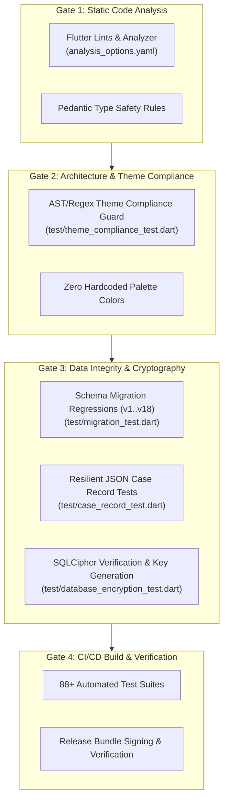

# ClinicPilot — Quality Gates & Verification Architecture

> **Engineering Standard: Static Analysis, Theme Compliance Verification, Schema Regression Testing & CI/CD Release Criteria**

---

## 1. The Quality Gate Philosophy

ClinicPilot operates in a high-stakes domain: medical practice management and clinical decision support. In a clinical consultation chamber, software failures do not just cause developer inconvenience—they risk patient record corruption, prescription errors, tax non-compliance, and clinic revenue loss.

To guarantee carrier-grade reliability on distributed offline mobile devices, ClinicPilot enforces an unyielding **Multi-Layered Quality Gate Architecture**:



---

## 2. Zero Hardcoded Colors & Dynamic Palette Enforcement

### 2.1 The Architectural Rationale
A major failure mode in Flutter applications with multiple themes is "color leakage"—when a developer hardcodes an inline hex color (`Color(0xFF0F5132)`) or uses a Flutter standard color (`Colors.teal`, `Colors.blue`). 

When a doctor switches between themes (e.g. from **Emerald** to **Monochrome** or **Dark Mode**):
- Hardcoded colors remain stubbornly static while surrounding background surfaces invert.
- Contrast ratios plummet below WCAG 2.1 AA accessibility standards (e.g. dark teal text on a dark gray surface becomes illegible).
- UI polish and clinical legibility are completely compromised.

In ClinicPilot, **no feature widget is ever permitted to declare an inline color or static palette constant**. All visual colors must resolve dynamically from the active `ThemeData`:
```dart
// FORBIDDEN:
final textColor = Colors.teal; // Build fails CI!
final cardBg = Color(0xFFF1F5F9); // Build fails CI!

// REQUIRED:
final scheme = Theme.of(context).colorScheme;
final textColor = scheme.primary;
final cardBg = scheme.surfaceContainerHighest;
```

---

## 3. Static Theme Compliance Guard (`test/theme_compliance_test.dart`)

To enforce the zero-hardcoded-color rule programmatically, ClinicPilot incorporates an automated static analysis test in [`test/theme_compliance_test.dart`](file:///d:/my-quests/side-projects/ClinicPilot/test/theme_compliance_test.dart):

```dart
void main() {
  test('no hardcoded colours outside the theme and design layers', () {
    final offenders = <String>[];

    final namedColour = RegExp(
      r'\bColors\.(red|blue|teal|green|orange|purple|amber|grey|white|black|'
      r'indigo|cyan|pink|lime|brown|deepOrange|redAccent|blueAccent|black87)\b',
    );
    final hexColour = RegExp(r'Color\(0x[Ff][Ff]');

    for (final entity in Directory('lib').listSync(recursive: true)) {
      if (entity is! File || !entity.path.endsWith('.dart')) continue;

      final path = entity.path.replaceAll(r'\', '/');
      // Whitelisted files that legitimately define fixed palette foundations
      // or print to physical paper (PDF renderers).
      if (path.contains('core/theme/') ||
          path.contains('core/design/') ||
          path.contains('pdf_service') ||
          path.contains('pdf_export_service')) {
        continue;
      }

      final lines = entity.readAsLinesSync();
      for (var i = 0; i < lines.length; i++) {
        final line = lines[i];
        if (namedColour.hasMatch(line) || hexColour.hasMatch(line)) {
          offenders.add('$path:${i + 1}  ${line.trim()}');
        }
      }
    }

    expect(
      offenders,
      isEmpty,
      reason:
          'Resolve colours from Theme.of(context).colorScheme instead:\n'
          '${offenders.join('\n')}',
    );
  });
}
```

### 3.1 Exemption Architecture
Only two subsystems are exempt from the dynamic color rule:
1. `lib/core/theme/` and `lib/core/design/`: Where the underlying palette primitives (`AppColors`, `AppTheme`) are defined.
2. `pdf_service.dart` / `pdf_export_service.dart`: PDF document generators print to physical white paper, where theme context has no meaning and high-contrast fixed ink colors are legally required.

---

## 4. Static Analysis Rules (`analysis_options.yaml`)

Static code health is guarded by [`analysis_options.yaml`](file:///d:/my-quests/side-projects/ClinicPilot/analysis_options.yaml), inheriting from `package:flutter_lints/flutter.yaml`.

Key analyzer guidelines enforced across the codebase:
- **Strict Null Safety**: Zero unsound null assertions or force-unwrap operations (`!`) in data transformations.
- **Const Correctness**: Enforcing compile-time constant instantiation (`prefer_const_constructors`, `prefer_const_literals_to_create_immutables`) to minimize widget rebuild allocations on mobile devices.
- **Unused Import Prevention**: Keeping Dart compilation bundles compact.
- **Avoid Prints**: Diagnostic logging must use structured loggers rather than raw `print()` statements.

---

## 5. Serialization & Data Integrity Testing

The test suite contains **88+ automated test files** verifying every tier of the application. Three test suites form the backbone of data integrity assurance:

### 5.1 Database Schema Migration Verification (`test/migration_test.dart`)
- **Mission**: Verify that an existing database created under Schema Version 1 can upgrade sequentially to Schema Version 18 without a single byte of patient or billing data loss.
- **Technique**: Constructs raw SQLite database instances populated with historical fixture data, invokes `AppDatabase(executor).migration.onUpgrade`, and asserts that:
  - Backfilled columns retain accurate values.
  - Foreign key relations remain intact.
  - Unique indices (such as `idx_patients_clinic_serial`) construct cleanly over historical data.

### 5.2 Case Record Serialization Resilience (`test/case_record_test.dart`)
- **Mission**: Guarantees that all 17 clinical sections round-trip cleanly between Dart domain objects and serialized SQLite JSON strings.
- **Defensive Fallback Verification**: Asserts that corrupted or missing JSON properties fall back to safe default values (`const PatientIdentificationDetails()`) rather than throwing unhandled exceptions.
- **Legacy String Parsing**: Validates that legacy free-text symptoms from earlier schema revisions deserialize into modern structured fields (`PastDiseaseEntry`, `ChiefComplaintDetail`).

### 5.3 Cryptographic Integrity (`test/database_encryption_test.dart`)
- **Mission**: Validates the SQLCipher encryption handshake.
- **Verification**: Asserts that raw SQLite database handles successfully execute `PRAGMA cipher_version;`, verifying that the underlying native binary is authentic SQLCipher and that keys generated via `DatabaseEncryptionService` properly unlock the database.

---

## 6. CI/CD Build Gates & Release Criteria

Before any code artifact is promoted to staging or distributed as a release APK/AAB/EXE, it must satisfy five mandatory verification criteria:

| Gate # | Phase | Automated Command | Acceptance Criteria |
| :--- | :--- | :--- | :--- |
| **1** | Static Code Analysis | `flutter analyze` | **0 errors, 0 warnings, 0 lint violations**. Clean exit code `0`. |
| **2** | Theme Compliance | `flutter test test/theme_compliance_test.dart` | **0 hardcoded colors** detected outside whitelisted theme/design layers. |
| **3** | Full Regression Suite | `flutter test` | **100% pass rate** across all 88+ test suites (0 test failures). |
| **4** | Schema Migration Test | `flutter test test/migration_test.dart` | Sequential v1 $\rightarrow$ v18 migration executes cleanly with zero SQLite syntax errors. |
| **5** | Release Build Integrity | `flutter build apk --release` | ProGuard / R8 code shrinking succeeds with zero missing class symbol warnings. |

---

## 7. Operational Runbook: Diagnosing Quality Gate Failures

### 7.1 Theme Compliance Failure
```text
Expected: <empty>
  Actual: ['lib/features/patients/patient_card.dart:45 Colors.blue']
Reason: Resolve colours from Theme.of(context).colorScheme instead
```
- **Remedy**: Locate the offending line and replace `Colors.blue` with `Theme.of(context).colorScheme.primary` (or appropriate token).

### 7.2 Migration Step Failure
```text
SqliteException: duplicate column name: serial_no
```
- **Remedy**: Ensure the migration step calls `_addColumnIfMissing(m, table, column)` instead of `m.addColumn(table, column)` to prevent crashes on previously upgraded databases.
