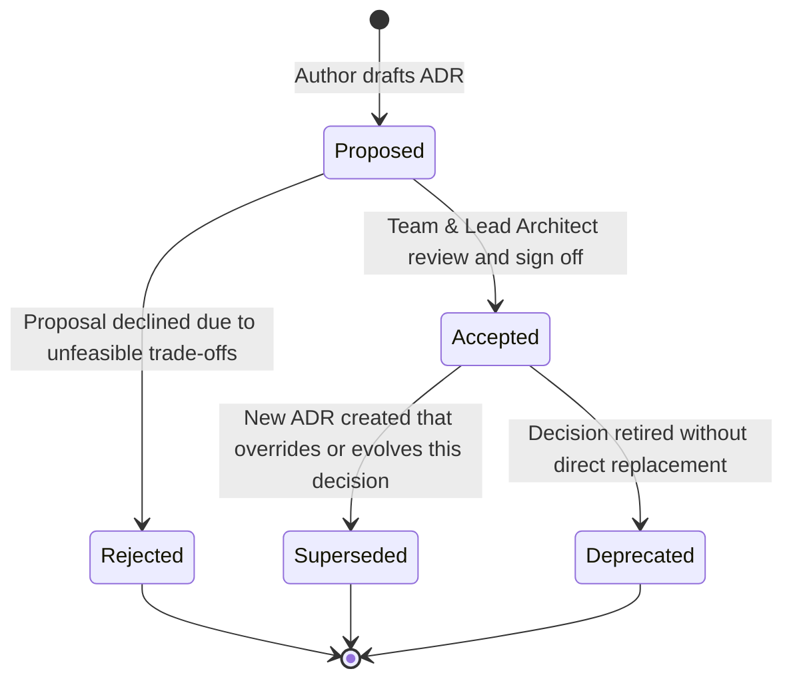

# ClinicPilot Architecture Decision Records (ADRs)

This directory hosts the formal Architecture Decision Records (ADRs) for **ClinicPilot**, a high-performance, offline-first clinical practice management system designed for solo and multi-clinic doctors (specializing in homeopathy, general practice, and multi-specialty care).

ADRs document significant architectural, technical, and governance decisions made throughout the evolution of the software. They provide historical rationale, evaluate trade-offs, detail mitigations, and establish criteria under which prior decisions may be re-evaluated.

---

## Decision Status Lifecycle

Each ADR adheres to a standardized state machine:

- **Proposed**: The decision is submitted for architectural review and under peer consideration.
- **Accepted**: The decision has been approved, ratified, and implemented within the codebase.
- **Rejected**: The decision was evaluated and declined. The record remains for institutional memory.
- **Superseded**: The decision was formerly accepted but has been superseded by a newer ADR (must cross-link to the succeeding record).
- **Deprecated**: The decision is no longer active or relevant to the operational architecture.

---

## ADR Document Anatomy

Every ADR follows an uncompromising, production-grade structure:

1. **Title & Identifier**: Unique numeric identifier (`ADR-XXX`) with an expressive slug.
2. **Status & Metadata**: Current status, date of ratification, deciders/stakeholders, and consults.
3. **Context**: Problem statement, clinical operational workflow requirements, regulatory constraints (DISHA, HIPAA, GDPR), and architectural tensions.
4. **Options Considered**: Deep comparison matrix of all evaluated technologies or architectural paradigms, highlighting explicit Pros and Cons.
5. **Decision**: Explicit, unambiguous statement of the chosen architecture and implementation strategy.
6. **Rationale**: Technical, operational, and clinical rationale explaining why the winning option outperformed alternatives.
7. **Consequences**:
   - **Positive Impacts**: Concrete engineering, operational, and UX gains.
   - **Negative Trade-offs**: Incurred technical debt, overhead, or performance costs.
   - **Mitigation Strategies**: Specific code patterns, testing gates, or architectural patterns neutralizing the trade-offs.
8. **Reconsideration Trigger**: Measurable technical or business conditions that mandate re-opening the architectural decision.

---

## Architecture Decision Index

| ID | Title | Date | Status | Authors / Deciders | Summary |
| :--- | :--- | :--- | :--- | :--- | :--- |
| [ADR-001](ADR-001-offline-first-sqlite.md) | **Offline-First Persistence via Drift SQLite Engine** | 2026-03-10 | **Accepted** | Core Architecture Team | Drift SQLite chosen over Realm, ObjectBox, Hive, and Firestore for schema migrations, strict ACID guarantees, and DISHA/HIPAA compliance. |
| [ADR-002](ADR-002-zero-hardcoded-tokens.md) | **Centralized Design Tokens & Enforced Theme Compliance Gate** | 2026-03-11 | **Accepted** | Frontend & UI/UX Governance | Enforce strict zero-hardcoded-color rules across screens using semantic tokens, guarded by automated CI unit test `theme_compliance_test.dart`. |
| [ADR-003](ADR-003-stateful-shell-navigation.md) | **GoRouter StatefulShellRoute for Multi-Branch State Preservation** | 2026-03-12 | **Accepted** | Client Navigation Team | Implement `StatefulShellRoute.indexedStack` across 5 primary branches with an independent top-bar clinic switcher without tab reloads. |
| [ADR-004](ADR-004-case-record-synthesis.md) | **Dynamic JSON Lineage & Backward-Compatible Case Record Schema** | 2026-03-13 | **Accepted** | Clinical Domain & Data Architecture | Hybrid relational SQLite + versioned JSON columns storing the 17-section homeopathic case record, preserving historical record immutability. |
| [ADR-005](ADR-005-multi-clinic-isolation.md) | **Active Clinic Tenancy Scoping & Cross-Clinic Aggregation** | 2026-03-14 | **Accepted** | Platform Architecture Team | Single local database multi-tenancy utilizing `clinic_id` filtering at the provider layer, maintaining strict partition while permitting aggregate practice analytics. |
| [ADR-006](ADR-006-encrypted-backup.md) | **AES-GCM 256-bit Encrypted Local Container Backup (`.cpbak`)** | 2026-03-15 | **Accepted** | Security & Privacy Architecture | Password-derived AES-GCM 256-bit encrypted ZIP containers packaging database tables, SHA-256 manifests, and physical media with de-identification options. |

---

## Governance & Maintenance

- **Authoring**: To propose a new architecture decision, copy an existing ADR as a baseline, assign the next sequential integer identifier (`ADR-007+`), set status to `Proposed`, and submit a pull request with technical benchmarks and architectural justifications.
- **Review Cadence**: Architecture decisions undergo formal review during release planning milestones.
- **Verification**: Decisions accompanied by compliance tests (e.g. `theme_compliance_test.dart`) must remain green in CI pipelines across all commits.
