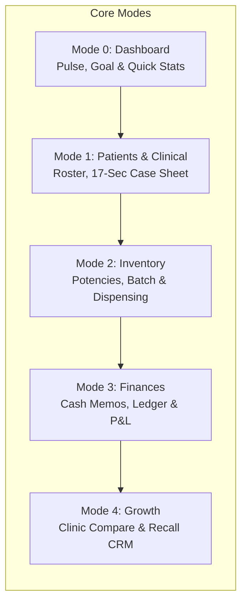

# ClinicPilot — Product Strategy & Clinical Architecture Portal

> **The Autonomous Practice Operating System for the Independent Doctor**  
> *Mobile-first, Offline-first, Zero SaaS Overhead, Total Clinical & Data Sovereignty.*

---

## 1. Executive Summary

**ClinicPilot** is a purpose-built practice operating system engineered specifically for solo practitioners, visiting specialists, and homeopathic physicians operating across multiple physical clinics in high-density outpatient (OPD) settings.

Traditional clinic management software (Practo, Cliniko, Hospital ERPs) is designed around desktop reception desks, multi-step administrative wizards, continuous cloud connectivity, and extractive subscription models. In contrast, **ClinicPilot is designed from the physical realities of the doctor's consultation chamber**:
- The doctor works **standing up or seated**, rotating between examination, quick case interrogation, and medicine dispensing.
- High-velocity outpatient flow: **30 to 50 patients seen within a compressed 2 to 3-hour evening window** (averaging 2–4 minutes per patient).
- Zero reliance on stable cellular data or clinic Wi-Fi; **100% offline-first execution** powered by on-device SQLite (Drift ORM) with hardware-accelerated AES-256 encryption.
- Direct alignment with practice economics: **tracking true net profit per physical clinic** (accounting for location-specific rent, medicine cost, and footfall) while eliminating patient churn.

---

## 2. Product Documentation Index

This directory maintains the strategic, clinical, and operational blueprints governing ClinicPilot's feature design and product evolution.

```
docs/product/
├── README.md                      # [You Are Here] Product portal overview & directory map
├── vision.md                      # Product vision, target persona (Dr. Zaid), market positioning, and growth strategy
├── principles.md                  # Five non-negotiable design & engineering axioms for sub-second OPD flow
├── opd-workflows.md               # Minute-by-minute operational breakdown of a 2-hour high-throughput evening OPD
└── homeopathic-clinical-scope.md  # Exhaustive domain manual: potencies, vehicles, repertorization, and posology
```

### Core Documents

| Document | Primary Focus | Key Audience |
|---|---|---|
| [**vision.md**](./vision.md) | Persona deep dive (Dr. Zaid), economic model, the solo-doctor dilemma, acquisition vs. retention loops. | Product Managers, Founders, Clinical Advisors |
| [**principles.md**](./principles.md) | Non-negotiable UX/UI & technical axioms (Speed > Polish, Offline-first, Ergonomic touch, Cognitive offloading). | Designers, Mobile Engineers, QA Engineers |
| [**opd-workflows.md**](./opd-workflows.md) | Realistic 6-phase journey of an evening OPD session: queue triage, 60s intake, 3min case taking, dispensing, cash memo, closing. | Clinical UX Designers, Frontend Developers |
| [**homeopathic-clinical-scope.md**](./homeopathic-clinical-scope.md) | Posology scales (C, X, LM), vehicles (globules, sugar of milk, mother tinctures), Kent/Boenninghausen rubrics, Hering's law. | Healthcare Informaticists, Clinical Engineers |

---

## 3. The ClinicPilot Operating Framework

ClinicPilot structures practice management into **5 unified interaction modes**, mapping directly to the physical journey of a consulting doctor:



1. **Practice Pulse (Dashboard)**: Instant situational awareness upon entering the clinic. Active clinic switcher, daily footfall vs. capacity, real-time revenue collection, and pending recall alerts.
2. **Clinical Care & Case Taking**: High-speed, multi-layer case recording. Supports rapid chief complaint logging, structured 17-section classical homeopathic case interrogation, symptom modalities, and longitudinal visit timelines.
3. **Pharmacy Inventory & Automated Dispensing**: Real-time stock decrementing for remedies across Decimal, Centesimal, and 50-Millesimal potencies. Batch expiration tracking and single-tap dispensing auto-labeling.
4. **Practice Finances & Cash Memos**: Sub-10-second cash memo generation. Cash, UPI, and split payment tracking with instant thermal receipt printing and WhatsApp digital bill delivery.
5. **Growth Intelligence & Multi-Clinic Tenancy**: Practice-level unit economics. Comparative growth analytics (e.g. Clinic A vs. Clinic B), marketing channel attribution (camps, referrals, Google reviews), and automated inactive patient recall.

---

## 4. Architectural Pillars

- **Local-First Autonomy**: All clinical data, patient identifiers, financial ledgers, and inventory logs are stored locally in an ACID-compliant SQLite relational database using Drift ORM. The app executes with 0ms network latency.
- **Privacy by Design**: No telemetry, no third-party trackers, no mandatory cloud backends. Database-level SQLCipher AES-256 encryption protects sensitive medical histories from device theft or forensic extraction.
- **Doctor-Owned Cloud Sync**: Optional zero-server-cost encrypted backup via doctor-owned Google Drive AppData container or local peer-to-peer Wi-Fi sync. The platform vendor never handles or sees patient health information (PHI).
- **Sub-Second Interaction Budget**: Strict 60 FPS scrolling, zero loading spinners on the critical clinical path, and input paradigms designed for thumb reach on mobile screens or hotkey navigation on physical tablets/laptops.

---

## 5. Strategic Roadmap Cross-Reference

To review current milestones, technical capabilities, and engineering delivery schedules, consult the accompanying roadmap portal:
- [**Roadmap Portal (`docs/roadmap/README.md`)**](../roadmap/README.md)
- [**Milestone Execution Matrix (`docs/roadmap/roadmap.md`)**](../roadmap/roadmap.md)
