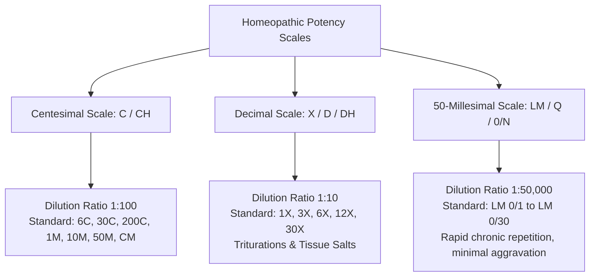
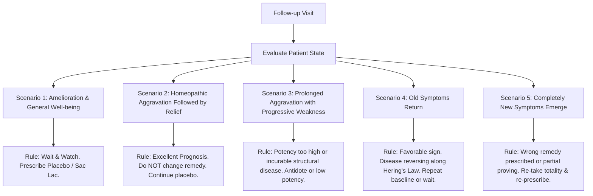

# ClinicPilot — Homeopathic Clinical Domain & Practice Scope

> **Clinical Architecture Manual: Posology, Repertorization Engines, Dispensing Modes & Longitudinal Follow-Up Evaluation**  
> *A Clinical Guide for Software Engineers, Informaticists, and Practicing Homeopathic Physicians.*

---

## 1. Domain Overview & Philosophical Foundation

Homeopathy is a system of holistic, individualized medicine established by Dr. Samuel Hahnemann in 1796, governed by the primary therapeutic law: ***Similia Similibus Curentur*** (*"Let likes be cured by likes"*). 

Unlike conventional allopathic medicine, which categorizes disease based on structural pathology and prescribes uniform chemical agents across patient populations, homeopathic clinical practice requires:
1. **The Totality of Symptoms**: Synthesizing the physical, mental, emotional, thermal, and miasmatic individualities of the human being into an integrated symptom portrait.
2. **Repertorization**: Mathematical and qualitative cross-referencing of observed symptoms against a vast clinical index (the *Repertory*) containing thousands of rubrics and remedy provings.
3. **Dynamic Posology & Dilution**: Administering ultra-diluted, dynamized (succussed or triturated) remedies tailored to the patient's vitality, pathological depth, and sensitivity.
4. **Longitudinal Direction of Cure**: Rigorous evaluation of follow-up reactions using **Hering’s Law of Cure** to distinguish true healing from superficial palliation, therapeutic aggravation, or suppression.

ClinicPilot embeds this clinical taxonomy directly into its software data structures, UI presets, and validation models.

---

## 2. Potency Scales & Posology Architecture

ClinicPilot natively supports the three foundational dynamization scales defined in the *Organon of Medicine* and the *Homeopathic Pharmacopoeia of India (HPI)*:



### 2.1 The Centesimal Scale (C / CH)
- **Mathematical Ratio**: 1 part medicinal substance to 99 parts neutral vehicle (alcohol/water), followed by 10 or 100 potentizing succussions (introduced in §270 of *Organon of Medicine*, 5th edition).
- **Supported Standard Potencies**:
  - **Low Potencies**: `3C`, `6C`, `12C` (used for local organic tissue affinities and sub-acute conditions).
  - **Medium Potencies**: `30C`, `200C` (the workhorse potencies for acute diseases and general constitutional initial prescriptions).
  - **High & Very High Potencies (Fluxions)**: `1M (1000C)`, `10M (10000C)`, `50M (50000C)`, `CM (100000C)` (reserved for deep constitutional mental totality, hereditary miasms, and high vitality with minimal gross tissue pathology).
- **Prescription Syntax in ClinicPilot**: Stored as a normalized enum with numerical potency and scale indicator: e.g., `Remedy: Arsenicum Album`, `Scale: Centesimal`, `Potency: 200C`.

### 2.2 The Decimal Scale (X / D / DH)
- **Mathematical Ratio**: 1 part medicinal substance to 9 parts neutral vehicle (introduced by Dr. Constantine Hering; ratio 1:10).
- **Clinical Applications**:
  - Primary scale for **Biochemic Tissue Salts** (Dr. Wilhelm Heinrich Schüssler's 12 Cell Salts, such as *Calcarea Fluorica*, *Magnesia Phosphorica*, *Ferrum Phosphoricum*).
  - Primary scale for insoluble mineral substances prepared via solid pestle mortar **Triturations** in lactose powder up to 6X.
- **Supported Standard Potencies**: `1X`, `2X`, `3X`, `6X`, `12X`, `30X`.
- **Prescription Syntax in ClinicPilot**: `Remedy: Magnesia Phosphorica`, `Scale: Decimal`, `Potency: 6X`, `Vehicle: Trituration Tablets`.

### 2.3 The 50-Millesimal Scale (LM / Q / 0/N)
- **Mathematical Ratio**: 1 part medicinal substance dynamized in 50,000 parts vehicle (developed by Samuel Hahnemann in the 6th edition of the *Organon*, §270).
- **Clinical Advantages**:
  - Highest dynamic medicinal action with virtually **zero dangerous therapeutic aggravation**.
  - Permitted for daily or alternate-day liquid repetition in severe chronic pathologies (e.g. progressive rheumatology, advanced endocrine disorders).
- **Supported Standard Potencies**: `LM 0/1` through `LM 0/30` (denoted as `0/1, 0/2, 0/3... 0/30`).
- **Prescription Syntax in ClinicPilot**: `Remedy: Thuja Occidentalis`, `Scale: FiftyMillesimal`, `Potency: LM 0/3`, `Dispensing: Liquid Succussion Bottle`.

---

## 3. Vehicles & Dispensing Modes

Solo practitioners dispense remedies directly in their consultation chambers. ClinicPilot models every physical dispensing mode:

| Dispensing Vehicle | Physical Characteristics | Standard Posology & Instructions | Inventory Unit Tracked |
|---|---|---|---|
| **Cane Sugar Globules / Pills** | Pure sucrose spheres, graded by diameter: **#10, #20, #30, #40** (most common: #20 & #30). Medicated with liquid dilution drops. | 4 to 6 pills dissolved dry on tongue, 15 minutes away from meals. | Dram vials (1 dram, 2 dram) or Gross bags. |
| **Sugar of Milk (Lactose Powder)** | Pure *Saccharum Lactis* powder folded into paper packets (*puffs* or *doses*). Used as single-dose powder or vehicle for LM/Centesimal potencies. | Empty one paper packet onto clean tongue at bedtime. | Kilogram canisters / Packets (Puffs). |
| **Mother Tinctures (Q / MT)** | Pure crude hydro-alcoholic extractions of botanical or zoological origins (e.g. *Crataegus Oxyacantha Q*, *Berberis Vulgaris Q*). | 10 to 15 drops in half a cup of lukewarm water, 2 to 3 times daily. | Milliliters (ml) / 30ml, 100ml, 450ml bottles. |
| **Trituration Tablets** | Compressed lactose chalk tablets containing decimal mineral preparations. | 2 to 4 tablets chewed or dissolved in warm water, TDS. | 25g, 100g, 450g bottles. |
| **Distilled Water / Alcohol Drops** | Liquid vehicle in dropper bottles (15ml, 30ml). Essential for LM scale succussion or acute split doses. | 10 succussions of bottle before each dose; take 1 teaspoonful in water. | Dropper bottles (oz / ml). |
| **Blank Sugar Pellets (Placebo / Sac Lac)** | Unmedicated lactose or sucrose. Essential in classical homeopathy to maintain posology discipline while allowing the simillimum time to act. | Continue taking 4 pills twice daily (Placebo). | Vials / Dram bottles. |

---

## 4. Repertorization Architecture & Totality Engines

The core intellectual challenge of homeopathic practice is finding the single curative remedy (*Simillimum*) from among thousands of possibilities. ClinicPilot provides a high-speed, on-device repertory engine built on relational rubric indexes:

```mermaid
flowchart TD
    CS[Patient Case Observation] --> ST[17-Section Symptom Triage]
    ST --> RSearch[Fast Full-Text Rubric Search]
    
    subgraph Repertory Methodologies
        RSearch --> KM[Kentian Hierarchy<br>Mental > Physical Generals > Particulars]
        RSearch --> BM[Boenninghausen Method<br>Complete Symptom: Location + Sensation + Modality + Concomitant]
        RSearch --> BGM[Boger-Boenninghausen<br>Pathological Generals & Tissue Affinities]
    end
    
    KM --> WE[Weighted Scoring Engine]
    BM --> WE
    BGM --> WE
    
    WE --> TS[Remedy Totality Table<br>Remedy | Rubric Coverage Count | Total Grade Sum]
    TS --> MA[Miasmatic Filter: Psora / Sycosis / Syphilis / Tubercular]
    MA --> SR[Ranked Simillimum Recommendations]
```

### 4.1 Symptom Hierarchies: Kent vs. Boenninghausen vs. Boger
ClinicPilot allows the physician to filter and prioritize rubrics according to the classical school matching the case:

1. **The Kentian Methodology (Dr. J.T. Kent)**:
   - **Hierarchy**:
     1. *Mental Generals*: Will, emotions, affections, intellect, memory (e.g., *Fear of dark*, *Weeping when consoled*, *Destructive rage*).
     2. *Physical Generals*: Thermal relations (chilly vs. hot), reactions to weather, food desires and aversions, sleep and dreams, menstruation.
     3. *Particulars*: Specific anatomical complaints with local sensations and modalities (e.g., *Stitching pain in right knee*).
   - Best suited for deep chronic constitutional cases where rich psychological and general symptoms are expressed.

2. **The Boenninghausen Methodology (Therapeutic Pocket Book)**:
   - **The Doctrine of Analogy & Complete Symptom**: Combines four distinct components to form a synthetic totality:
     $$\text{Complete Symptom} = \text{Location} + \text{Sensation} + \text{Modality} (\text{Aggravation / Amelioration}) + \text{Concomitant}$$
   - Allows modalities observed in one part of the body to apply by analogy to the whole constitution.
   - Best suited for patients with sparse mental symptoms but prominent physical sensations and modalities.

3. **The Boger-Boenninghausen Approach (Dr. C.M. Boger)**:
   - Emphasizes **Pathological Generals**, tissue affinities, chronological progression of disease states, and prominent modalities.

### 4.2 Totality Scoring Algorithm
When rubrics are pinned to an active case, ClinicPilot evaluates candidate remedies using a composite scoring algorithm:

$$\text{Totality Score}(R) = w_c \cdot \text{Coverage}(R) + \sum_{i=1}^{N} \text{Grade}(R, r_i) \cdot \text{HierarchyWeight}(r_i)$$

Where:
- $\text{Coverage}(R)$ is the count of selected rubrics that remedy $R$ covers.
- $\text{Grade}(R, r_i)$ is the classical remedy grade in rubric $r_i$ (typically Grade 1 = 1 pt, Grade 2 = 2 pts, Grade 3 = 3 pts, Grade 4 = 4 pts in Kent/Boenninghausen).
- $\text{HierarchyWeight}(r_i)$ applies clinical weighting:
  - Mental General: $1.5\times$
  - Physical General / Thermal: $1.3\times$
  - Particular / Local Modality: $1.0\times$
- $w_c$ is a penalty/bonus factor ensuring that a remedy covering all rubrics ranks above a remedy covering only one rubric with high intensity.

### 4.3 Miasmatic Classification & Triage
Hahnemann identified chronic disease progression as stemming from underlying constitutional dyscrasias (*Miasms*). ClinicPilot provides an integrated miasmatic evaluation tag:

```
┌─────────────────────────────────────────────────────────────────────────────┐
│                           HAHNEMANNIAN MIASMS                               │
├─────────────┬───────────────────────────┬───────────────────────────────────┤
│ Miasm       │ Core Biological Expression│ Hallmark Clinical Manifestations  │
├─────────────┼───────────────────────────┼───────────────────────────────────┤
│ **Psora**   │ Functional irritation,    │ Dry skin eruptions, pruritus,     │
│             │ deficiency, hypersensitivity│ neuralgias, anxiety, hyper-reflexia│
├─────────────┼───────────────────────────┼───────────────────────────────────┤
│ **Sycosis** │ Hyperplasia, excess,      │ Warts, polyps, fibroids, cysts,   │
│             │ incoordination, retention │ thick greenish discharges, gout   │
├─────────────┼───────────────────────────┼───────────────────────────────────┤
│ **Syphilis**│ Destruction, degeneration,| Ulcerations, bone pains, tissue     │
│             │ necrosis, structural loss │ necrosis, deep depression, suicidal│
├─────────────┼───────────────────────────┼───────────────────────────────────┤
│ **Tubercular** Alternating states, rapid│ Recurrent respiratory catarrh,    │
│ (Mixed)     │ emaciation, changeability │ allergies, ringworm, wandering mind│
└─────────────┴───────────────────────────┴───────────────────────────────────┘
```
In ClinicPilot, remedies can be filtered by their predominant anti-miasmatic spectrum (e.g. *Anti-Psoric: Sulphur, Calcarea Carb*; *Anti-Sycotic: Thuja, Medorrhinum*; *Anti-Syphilitic: Mercurius, Nitric Acid*; *Anti-Tubercular: Tuberculinum, Bacillinum*).

---

## 5. Longitudinal Follow-Up Assessment & Direction of Cure

The success of a homeopathic prescription cannot be judged merely by whether a single symptom disappeared; suppression of a superficial symptom may drive pathology deeper into vital organs.

### 5.1 Hering’s Law of Direction of Cure
ClinicPilot structures follow-up evaluations around the cardinal tenets of Dr. Constantine Hering:

```
True Healing Proceeds:
1. From Above Downward (e.g. Head eruptions resolve first, followed by feet).
2. From Within Outward (e.g. Internal asthma improves, followed by an external skin rash).
3. From More Important to Less Important Organs (e.g. Heart palpitations stop, joint stiffness remains).
4. In the Reverse Order of Symptom Appearance (e.g. The most recent symptom clears before the earliest).
```

### 5.2 Follow-Up Clinical Scenarios & Prescribing Guidelines
During follow-up visits, ClinicPilot presents the doctor with an automated decision framework based on Hahnemann's and Kent’s *Twelve Observations*:



| Follow-Up Observation | Interpretation | Clinical Action in ClinicPilot |
|---|---|---|
| **Quick, short aggravation followed by sustained improvement** | Accurate simillimum, high vitality. Ideal reaction. | Continue **Placebo (Sac Lac)**. Do not disturb the curative action. |
| **General improvement while local complaint remains unchanged** | Patient's vitality is strengthening from the interior; local pathology takes longer to clear. | Continue current potency or repeat at extended interval. |
| **Severe, prolonged aggravation with patient exhaustion** | Remedy was similar, but potency was dangerously high for low vital force; or deep organic pathology exists. | Antidote with complementary remedy or drop to low decimal potency (`6X` / `30C`). |
| **Return of old, long-forgotten symptoms** | Curative backward unwinding along Hering's Law (reverse order of appearance). | Reassure patient; do not change prescription. Old symptoms will resolve spontaneously. |
| **Entirely new, unrelated symptoms appear** | Remedy was partially indicated or an incorrect remedy provoked a pathogenesis. | Antidote or re-case the totality immediately. |

### 5.3 Antidote & Complementary Relationship Tracking
Homeopathic materia medica exhibits intricate inter-remedy relationships:
- **Complementary Remedies**: Follow well and complete the curative action initiated by another (e.g. *Belladonna* followed by *Calcarea Carbonica*; *Ignatia* followed by *Natrum Muriaticum*).
- **Inimical (Incompatible) Remedies**: Interfere with each other and cause discordance if prescribed in close sequence (e.g. *Causticum* and *Phosphorus*; *Apis Mellifica* and *Rhus Toxicodendron*).
- **Antidotes**: Neutralize excessive medicinal aggravations or toxic effects (e.g. *Camphora* as a universal herbal antidote; *Coffea Cruda* neutralizing *Nux Vomica*).

ClinicPilot maintains an on-device relational matrix of these interactions, surfacing proactive warnings if a newly selected remedy conflicts with the patient's recently active prescription.
