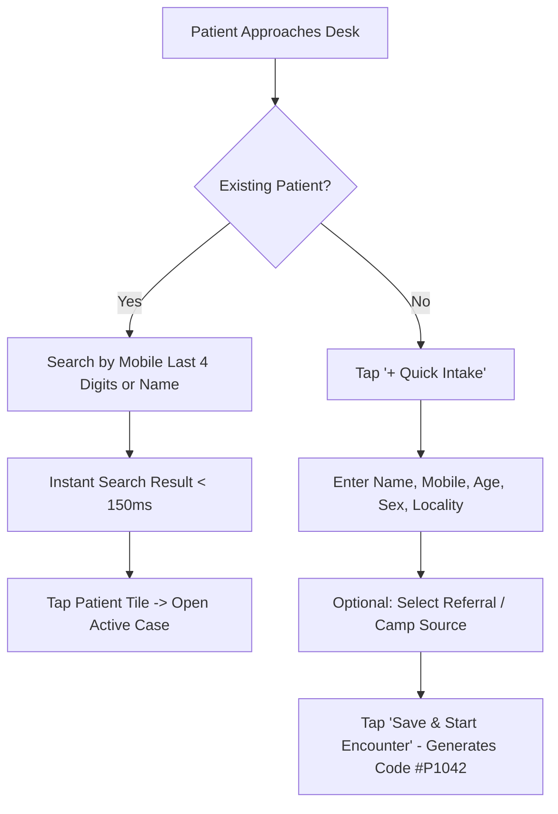

# ClinicPilot — Outpatient Clinic Operating Workflows (OPD Journey)

> **A Minute-by-Minute Operational Blueprint of a High-Throughput Evening OPD Session**  
> *Engineered for Solo Homeopathic & General Outpatient Practitioners Managing 30–50 Patients in 120–150 Minutes.*

---

## 1. The High-Velocity OPD Context

In high-density neighborhood clinics across urban India (such as Khidderpore, Kolkata), evening outpatient departments operate under intense time compression. 

### Operational Constraints & Clinic Dynamics
- **Clinic Hours**: 7:30 PM to 9:30 PM (2 hours = 120 minutes).
- **Patient Volume**: 30 to 45 patients (average encounter time: 2.5 to 4.0 minutes per patient).
- **Physical Setting**: A compact 8x10 ft chamber. No receptionist, no triage nurse, no compounder.
- **Doctor's Responsibilities**: 
  1. Greet the patient and build clinical rapport.
  2. Take the case history / evaluate follow-up reaction.
  3. Formulate the homeopathic totality or diagnosis.
  4. Manually dispense medicated globules, sugar of milk packets, or liquid drops.
  5. Calculate charges, collect cash or confirm UPI payment, and issue a bill.
  6. Document the encounter for future visits.

If digital software adds even 90 seconds of overhead per patient, the clinic runs 45 minutes late, queues spill into the street, patients leave in frustration, and the doctor burns out.

Below is the exhaustive, six-phase end-to-end workflow ClinicPilot executes to keep the doctor flowing at peak velocity.

```mermaid
journey
    title A 120-Minute Solo Clinic Session with ClinicPilot
    section Arrival (19:30)
      Unlock phone with biometric: 5: Doctor
      Switch active clinic to Babu Bazar: 5: Doctor
      Review today's target & overdue recalls: 4: Doctor
    section Intake (<60s)
      Walk-in patient gives mobile or name: 5: Doctor
      Instant search finds profile: 5: ClinicPilot
      Token slip generated / Queue added: 5: ClinicPilot
    section Clinical Encounter (2-4m)
      Review past case sheet & baseline remedy: 5: Doctor
      Capture chief complaint progression: 5: Doctor
      Triage physical/mental general rubrics: 4: Doctor
      Select remedy & potency preset: 5: Doctor
    section Dispensing (45s)
      Check batch stock on-screen: 5: ClinicPilot
      Dispense #20 globules in lactose powder: 4: Doctor
      Auto-print medicine label instruction: 5: ClinicPilot
    section Billing (<30s)
      One-tap Cash Memo calculation: 5: ClinicPilot
      Collect cash or show static UPI QR: 5: Doctor
      Thermal print receipt / WhatsApp PDF: 5: ClinicPilot
    section Reconciliation (21:30)
      Review cash tally vs UPI total: 5: Doctor
      Log clinic attendant tips / daily expense: 5: Doctor
      Inspect clinic net profit & close session: 5: ClinicPilot
```

---

## 2. Phase 1: Clinic Arrival, Tenancy Switch & Queue Inspection
**Time Allocation: 5 Minutes (19:30 – 19:35)**

### Physical Scene
Dr. Zaid arrives at the Babu Bazar chamber. The waiting area already has 12 patients seated on wooden benches. He sets down his bag, unlocks his phone via biometric fingerprint, and opens ClinicPilot.

```
┌─────────────────────────────────────────────────────────────┐
│ CLINICPILOT                          [Babu Bazar Clinic ▼]  │
│ Tue, 16 Sep | 19:30                       [🔔 3] [⚙️]       │
├─────────────────────────────────────────────────────────────┤
│ TODAY'S PULSE                                               │
│   Queue: 0 active     Footfall: 0 seen    Revenue: ₹0       │
│   Target: ₹2,500/day  Rent/day: ₹115      Status: On Track  │
├─────────────────────────────────────────────────────────────┤
│ ⚠️ OVERDUE RECALL ALERTS (Active Clinic)                    │
│   • Mohd. Rizwan (Allergic Rhinitis) — 4 days overdue [💬]  │
│   • Anjali Shaw (PCOS / Calcarea Carb) — 7 days overdue [💬]│
│   • Master Arhan (Adenoids / Agraphis) — 10 days over [💬]  │
├─────────────────────────────────────────────────────────────┤
│ QUICK ACTIONS                                               │
│  [ + Quick Intake ]   [ 📋 Queue ]   [ 🧾 Cash Memo ]       │
└─────────────────────────────────────────────────────────────┘
```

### Digital Workflow
1. **Clinic Tenancy Verification**:
   - The top app bar prominently displays the currently active clinic with a distinct location color badge (e.g. Emerald Green for *Babu Bazar*, Royal Blue for *Kidderpore High Road*).
   - If the doctor is at the alternate clinic, a single tap on the clinic header opens a modal to switch clinics. All subsequent patient queues, cash memos, stock inventories, and revenue statistics immediately filter to that physical facility.
2. **Pulse & Target Inspection**:
   - The dashboard displays today's operational targets: Daily break-even threshold (monthly rent ₹3,000 / 26 days = ₹115/day fixed cost), target revenue (₹2,500/day to reach ₹50,000/month net profit), and historical Tuesday average footfall.
3. **Recall Triage**:
   - The doctor reviews 3-5 critical overdue recall chips. If any of these patients are already waiting outside in the hallway, the doctor mentally notes their presence; if not, they can be contacted via 1-tap WhatsApp during a lull.

---

## 3. Phase 2: Rapid Patient Intake & Queue Insertion
**Time Allocation: Under 60 Seconds per Patient Encounter**

### Physical Scene
The first patient enters: *"Doctor, I came two weeks back for my knee pain"* or a brand-new patient walks in holding an old hospital discharge summary.

### Digital Workflow



#### Scenario A: Returning Patient (Sub-15 Seconds)
1. Doctor taps the search field in the bottom bar or top banner.
2. Doctor types either:
   - Last 4 digits of phone number (`9831`), OR
   - First 3 letters of patient name (`Riz`), OR
   - Unique patient code (`#1024`).
3. Results filter in real-time (< 150ms).
4. Doctor taps the patient card. The app instantly transitions to the **Patient Profile & Longitudinal Case Timeline**.

#### Scenario B: New Patient Intake (Sub-45 Seconds)
1. Doctor taps the prominent `+ Quick Intake` floating action button.
2. Minimal high-speed intake form opens (only 4 essential fields required):
   - **Full Name**: e.g., `Shabana Khatoon`
   - **Mobile Number**: 10 digits (triggers automated WhatsApp messaging)
   - **Age / Sex**: `34 / Female`
   - **Locality / Area**: Dropdown chip or quick text (e.g. `Babu Bazar`, `Metiabruz`, `Watgunge`)
3. Optional Growth Field: **Source** (Walk-in, Google Review, Sunday Diabetes Camp, Chemist Referral).
4. Doctor taps **"Start Consultation"**. A unique alphanumeric code (`BB-2026-084`) is auto-minted, and the consultation screen opens instantly.

---

## 4. Phase 3: Clinical Encounter & Homeopathic Repertorization
**Time Allocation: 2 to 5 Minutes**

### Physical Scene
Dr. Zaid is seated opposite the patient. He asks targeted questions about symptom progression, modality changes (worse from cold damp weather, better from warm applications), mental disposition, and sleep patterns.

### Digital Workflow
ClinicPilot provides a specialized **Dual-Speed Clinical Engine**:
- **Speed Track (Acute Encounter / Routine Follow-up)**: 90 seconds.
- **Deep Classical Track (Chronic First Visit)**: 4 to 5 minutes.

```
┌─────────────────────────────────────────────────────────────┐
│ ◀ Shabana Khatoon (34F) | Case #BB-084    [Follow-up #2]    │
├─────────────────────────────────────────────────────────────┤
│ CHIEF COMPLAINT: Osteoarthritis bilateral knees             │
│ Severity: [Mild] [Moderate] [● Severe]   Modality: < Cold   │
├─────────────────────────────────────────────────────────────┤
│ 17-SECTION CASE TRIAGE (Tap to expand)                      │
│ [✓] 1. Identification      [✓] 8. Physical Generals         │
│ [✓] 2. Chief Complaints    [●] 9. Mental Generals & Mind    │
│ [ ] 3. History of Illness  [✓] 12. Miasmatic Analysis       │
├─────────────────────────────────────────────────────────────┤
│ REPERTORIAL QUICK-TAGS & TOTALITY                           │
│  Selected Rubrics (3):                                      │
│  • Extremities - Pain - Knees - cold damp weather agg.      │
│  • Mind - Anxiety - health about, despair of recovery       │
│  • Generals - Warmth - amel. (Heat of bed relieves)         │
│  Top Remedies: Rhus Tox (9/3) | Calc Carb (7/3) | Bry (6/2) │
├─────────────────────────────────────────────────────────────┤
│ PRESCRIPTION SELECTION                                      │
│  Remedy: [ Rhus Toxicodendron          ▼ ] Potency: [ 200C ]│
│  Vehicle: [ Globules #20 in Sugar of Milk ]                 │
│  Dosage: [ 4 pills twice daily after food x 14 days ]       │
└─────────────────────────────────────────────────────────────┘
```

#### Step 1: Longitudinal Follow-up Evaluation
- For returning patients, ClinicPilot displays the **Last Prescription Banner** at the very top: *"14-day course of Rhus Tox 30C dispensed on 02 Sep 2026"*.
- Single-tap **Progression Comparison**:
  - `Better (>50%)` | `Status Quo (No Change)` | `Aggravated / Worse` | `New Symptoms Appeared`.
  - If "Better", the app prompts for *Placebo / Sac Lac* (Saccharum Lactis) continuation according to classical Organon posology rules.

#### Step 2: 17-Section Symptom Triage & Rubric Selection
- The case sheet is divided into 17 standardized clinical sections (Mental Generals, Physical Generals, Thermals, Desires/Aversions, Miasms, etc.).
- Instead of forcing linear completion, sections are presented as collapsed chips with completion status badges.
- **Instant Search Rubric Selector**: Doctor types `"cold agg"` -> The system surfaces matching classical rubrics across Kent and Boenninghausen repertories.
- As rubrics are pinned, ClinicPilot runs an on-device totality scoring calculation, displaying the top candidate homeopathic simillimums with their numerical gradings.

#### Step 3: Posology & Remedy Selection
- Doctor selects the simillimum remedy (e.g. *Rhus Toxicodendron*).
- **Single-Tap Potency Chips**: `[ 6C ] [ 30C ] [ 200C ] [ 1M ] [ 10M ] [ LM 0/1 ] [ Q ]`.
- **Vehicle Presets**: `[ Globules #20 ] [ Sugar of Milk (Puffs) ] [ Distilled Drops ] [ Mother Tincture Q ]`.
- **Posology Rule**: `[ OD (Morning) ] [ BD (Twice daily) ] [ TDS (Thrice daily) ] [ Stat ]`.
- Duration: `[ 7 Days ] [ 14 Days ] [ 21 Days ] [ 30 Days ]`.

---

## 5. Phase 4: Pharmacy Dispensing & Automated Labeling
**Time Allocation: 30 to 45 Seconds**

### Physical Scene
Dr. Zaid turns around to his medicine stock rack. He pulls down the 100ml stock bottle of *Rhus Tox 200C*, medicates four drams of blank cane-sugar globules (#20 size), taps them into a vial, and wraps 14 paper powder packets (*Sugar of Milk*).

### Digital Workflow
1. **Real-Time Stock Depletion Check**:
   - As soon as *Rhus Tox 200C* is chosen, the screen indicates current batch availability: *"Stock: 45ml remaining (Batch: SBL-8942, Exp: 2029)"*.
   - If stock falls below the doctor's custom reorder threshold (e.g. < 15ml), a discreet amber badge appears: `Low Stock Alert`.
2. **Automated Label Formatting**:
   - For practices utilizing a desktop Bluetooth thermal label printer or mini sticker printer, ClinicPilot sends a compact ESC/POS print command for a medicine bottle label:
     ```
     DR. ZAID'S CLINIC | Babu Bazar
     Pt: Shabana Khatoon (34F)  Date: 16-Sep-2026
     Rx: Rhus Tox 200C (Globules #20)
     Dose: 4 pills twice daily on an empty tongue
     Next Visit: 30-Sep-2026
     ```
3. **Dispensing Confirmation**:
   - Single tap on `Dispense & Bill`. Medicine is deducted from the local database ledger with zero lag.

---

## 6. Phase 5: Cash Memo Generation & Instant Payment Collection
**Time Allocation: Under 30 Seconds**

### Physical Scene
The patient asks: *"Doctor, how much is the total?"* The doctor needs to present the fee, collect cash or confirm a UPI QR scan, and hand over a receipt without opening a separate calculator or physical ledger book.

### Digital Workflow

```
┌─────────────────────────────────────────────────────────────┐
│ 🧾 CASH MEMO #CM-2026-0419                                  │
│ Patient: Shabana Khatoon         Clinic: Babu Bazar         │
├─────────────────────────────────────────────────────────────┤
│ Consultation Fee (Standard Follow-up)              ₹150.00  │
│ 14-Day Dispensed Remedies (Rhus Tox 200C + SacLac) ₹100.00  │
│ TOTAL PAYABLE:                                     ₹250.00  │
├─────────────────────────────────────────────────────────────┤
│ PAYMENT METHOD:                                             │
│  [● Cash: ₹250]     [ UPI / QR ]     [ Split / Pending ]    │
├─────────────────────────────────────────────────────────────┤
│ ACTIONS                                                     │
│  [ 🖨️ Thermal Print (2-Inch) ]   [ 📲 Share on WhatsApp ]   │
│  [ ✓ Collect & Next Patient (Enter) ]                       │
└─────────────────────────────────────────────────────────────┘
```

1. **Auto-Populated Charges**:
   - Consultation fee automatically populates according to clinic rules (e.g. ₹200 for new case, ₹150 for follow-up).
   - Remedy dispensing charges calculate based on the number of days or bottles dispensed (e.g. ₹100 for 14-day supply).
2. **Payment Mode Selection**:
   - Defaults to **Cash** (which accounts for ~80% of transactions in traditional markets).
   - If **UPI** is selected, a single tap displays the doctor’s dynamic or static UPI QR code on screen. The patient scans directly from the doctor’s phone screen.
3. **Receipt Delivery**:
   - **Option A (Paperless WhatsApp)**: One tap opens WhatsApp with a pre-formatted digital PDF bill and dosage instructions sent to the patient's phone number.
   - **Option B (Thermal Receipt)**: Wireless print to a portable 58mm Bluetooth thermal printer sitting on the desk.
4. **Queue Advance**:
   - Doctor hits `Collect & Next Patient`. The patient profile closes, today's revenue counter increments by ₹250, and the search screen clears, ready for the next patient in the queue.

---

## 7. Phase 6: End-of-Day Clinic Reconciliation & Closure
**Time Allocation: 5 Minutes (21:30 – 21:35)**

### Physical Scene
It is 9:30 PM. The final patient has left. Dr. Zaid needs to count the physical cash in his drawer, verify UPI transfers in his banking app, pay the clinic boy/attendant his daily tea tip or room cleaning allowance, and lock the clinic chamber.

### Digital Workflow

```
┌─────────────────────────────────────────────────────────────┐
│ 🏁 END-OF-DAY CLINIC CLOSING REPORT                         │
│ Babu Bazar Clinic | Tuesday, 16 Sep 2026                    │
├─────────────────────────────────────────────────────────────┤
│ TOTAL CONSULTATIONS: 32 Patients                            │
│  • New Registrations: 6 (18.7%)                             │
│  • Follow-up Consultations: 26 (81.3%)                      │
├─────────────────────────────────────────────────────────────┤
│ FINANCIAL RECONCILIATION:                                   │
│  Total Gross Revenue:                             ₹7,400.00 │
│  ├── Cash in Drawer:                   ₹5,800.00            │
│  └── UPI Bank Transfers:               ₹1,600.00            │
│                                                             │
│ DAILY EXPENSES LOGGED:                                      │
│  • Chamber Cleaning & Tea:               ₹100.00            │
│  • Vial Bottles Purchase:                ₹300.00            │
│  Total Operating Expenses:                         - ₹400.00│
│                                                             │
│ FIXED RENT ACCRUAL (₹3,000 / 26 days):             - ₹115.38│
│ ESTIMATED MEDICINE COST OF GOODS:                  - ₹480.00│
├─────────────────────────────────────────────────────────────┤
│ ⭐ TODAY'S TRUE NET PROFIT:                       ₹6,404.62 │
├─────────────────────────────────────────────────────────────┤
│ [ 🔒 Confirm & Close Clinic Session ]                       │
└─────────────────────────────────────────────────────────────┘
```

1. **Cash Drawer Verification**:
   - The app indicates exact expected cash (`₹5,800`). The doctor counts the physical paper notes in the drawer. If there is a discrepancy, a quick adjustment note can be added.
2. **Instant Expense Logging**:
   - Doctor logs any cash paid out from the drawer (e.g. ₹100 clinic cleaning or ₹300 medicine courier).
3. **Net Profit Transparency**:
   - Unlike generic software that shows ₹7,400 gross and fosters an illusion of wealth, ClinicPilot subtracts clinic fixed rent accrual and wholesale medicine depletion to show **₹6,404.62 true profit**.
4. **Session Lock & Auto-Backup**:
   - Tapping `Confirm & Close Clinic Session` locks today's records from accidental editing.
   - If connected to cellular data or home Wi-Fi, ClinicPilot initiates an asynchronous, encrypted zero-knowledge snapshot of the SQLite database to the doctor's personal Google Drive container.
5. **Doctor Peace of Mind**:
   - Dr. Zaid puts his phone in his pocket and heads home, completely organized, with zero paperwork left for midnight.

---

## 8. Failure Modes & Graceful Fallbacks

| Failure Event | Physical Context | ClinicPilot Fallback Mechanism |
|---|---|---|
| **Zero Cellular Reception** | Basements, thick concrete alleys | App operates 100% offline via local SQLite; no UI spinners or stalls. |
| **Phone Battery Critical (<5%)** | Power outage, forgot power bank | Screen supports ultra-dark AMOLED high-contrast mode; database executes instant ACID writes on every field defocus. |
| **Patient Has No Mobile Phone** | Elderly or pediatric patients | System permits saving with an auto-generated surrogate code (`NO-PHONE-XXXX`); mobile is never mandatory. |
| **Printer Out of Paper / Bluetooth Disconnect** | Thermal paper roll exhausted | Fallback immediately to on-screen QR code or direct WhatsApp PDF share; consultation is never interrupted. |
| **Emergency Case Interruption** | Walk-in acute asthma or trauma while examining chronic patient | Single-tap "Suspend Case" puts current case on temporary hold; launches acute intake in 1 tap; resumes suspended case seamlessly later. |
