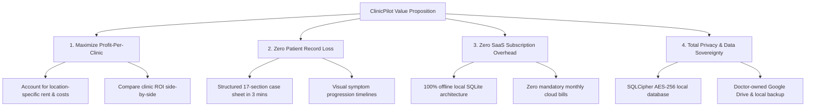
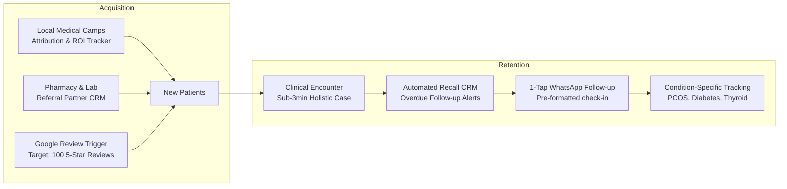

# ClinicPilot — Product Vision & Strategic Positioning

> **The Autonomous Solo-Doctor Operating System**  
> *Empowering independent clinical practitioners to master multi-clinic unit economics, elevate patient care, and retain complete data sovereignty.*

---

## 1. The Core Vision

The global healthcare software industry is obsessed with the enterprise: multi-specialty hospital chains, complex billing bureaucracy, insurance claim clearance houses, and venture-funded telemedicine conglomerates. In their wake, a massive, vibrant, and foundational segment of healthcare has been systematically neglected: **the independent solo outpatient practitioner**.

In India and across emerging healthcare markets, over 70% of primary and holistic healthcare encounters happen in modest, independent neighborhood clinics. These doctors are not hospital employees; they are **micro-entrepreneurs, clinicians, and chief operators all in one**. They consult without assistants or billing receptionists. They rent consultation spaces on alternate evenings across high-density urban or semi-urban localities. They stand in cramped chambers, diagnosing, prescribing, and dispensing medicine with their own hands under intense time pressure.

**ClinicPilot’s Vision is to be the definitive Autonomous Operating System for the Solo Doctor.**

We do not build software to help administrators audit doctors. We build software that acts as an invisible, friction-free cognitive co-pilot in the doctor's palm:
1. **Clinical Speed**: Capturing deep, structured homeopathic and medical cases in under 3 minutes without typing essays.
2. **Economic Clarity**: Transforming deceptive gross footfall numbers into granular **net profit per clinic**, taking rent, inventory overhead, and patient churn into account.
3. **Practice Continuity**: Providing 100% offline data resilience, ensuring that clinical charts, dispensing records, and financial ledgers belong solely to the doctor—forever, with zero recurring vendor hostage fees.

---

## 2. Target Persona: Dr. Zaid

To build an indispensable tool, ClinicPilot designs around the extreme, unforgiving operational constraints of its anchor user persona: **Dr. Zaid**.

```
┌─────────────────────────────────────────────────────────────────────────────┐
│                           ANCHOR USER PERSONA                               │
├─────────────────────────────────────────────────────────────────────────────┤
│ Name:             Dr. Zaid                                                  │
│ Degree:           BHMS (Bachelor of Homeopathic Medicine and Surgery), MD    │
│ Practice Type:    Solo Homeopathic Outpatient Practitioner                  │
│ Primary Chamber:  Babu Bazar, Khidderpore, Kolkata (High-density market)    │
│ Schedule:         Mon–Sat, 6:30 PM – 9:30 PM (often arriving by 7:30 PM      │
│                   after daytime clinical / institutional duties)            │
│ Target Throughput:30–50 patients per 2.5-hour evening OPD (2–4 min / encounter)│
│ Staffing:         100% Solo (No receptionist, no compounder, no assistant)   │
│ Physical Setup:   Standing/seated alternating in a compact 8x10 ft chamber  │
│ Hardware:         Single Android smartphone; occasional portable tablet      │
│ Network Reality:  Spotty 4G cellular; no reliable clinic Wi-Fi              │
└─────────────────────────────────────────────────────────────────────────────┘
```

### 2.1 The Multi-Clinic Operating Dilemma
Dr. Zaid splits his week across two distinct clinic locations on alternate evenings:
- **Clinic A (Established Old Clinic — Babu Bazar)**:
  - Rent: ₹3,000 / month.
  - Footfall: Steady baseline, multi-generational families, high neighborhood familiarity.
  - Historic Monthly Net Revenue: ₹15,000 – ₹16,000.
- **Clinic B (Expansion New Clinic — Kidderpore High Road)**:
  - Rent: ₹8,000 / month.
  - Footfall: Low initial awareness, sporadic walk-ins, high footfall turnover.
  - Historic Initial Net Revenue: ~₹0 (revenue barely covers rent and electricity).

When Dr. Zaid expanded from 1 clinic (6 days/week) to 2 clinics (3 days each), his gross workload doubled, his mental fatigue skyrocketed, but his net earnings plummeted:
```
Before 2nd Clinic: 1 Clinic @ 6 days/week  ->  ₹15,000 – ₹16,000 net profit
After  2nd Clinic: 2 Clinics @ 3 days/week ->  Clinic A: ₹8,000 + Clinic B: ~₹0  =  ₹8,000 net profit!
```
His physical business was bleeding because he lacked **comparative multi-clinic intelligence**. He could not instantly see whether the new clinic was an asset or a liability, what marketing channels drove footfall, or which patients stopped coming back after visit one.

### 2.2 The Consultation Rhythm & Ergonomic Constraints
- **Compressed Consultation Window**: Dr. Zaid arrives at 7:30 PM after a full day. 25–40 patients are waiting in the corridor. He has exactly 120 minutes.
- **Physical Dynamics**: He stands up to palpate an abdomen, turns around to pick a 30C dilution bottle from a shelf rack, dispenses 4 pills into a #20 vial, writes a dosage instruction, and collects ₹200 cash.
- **The Input Budget**: Any app requiring more than **3 to 4 taps per patient encounter** will be abandoned before patient #5. Forms with 20 empty text boxes are non-starters. The UI must be optimized for one-thumb reach while holding the phone in the left hand, or quick keyboard navigation when docked.

---

## 3. The Core Value Proposition

ClinicPilot resolves the existential operational pressures of independent practice through four pillars:



### Pillar 1: Maximize Profit-Per-Clinic
- **Unit Economics over Gross Headcount**: General clinic apps report gross collections, giving a false sense of success. ClinicPilot automatically deducts clinic-specific fixed overhead (monthly rent, electricity, clinic attendant tips) and variable medicine costs to report **True Net Profit per Location**.
- **The "Drop or Double Down" Decision**: Empowers the doctor to evaluate within 90 days whether a branch clinic is compounding or draining working capital.

### Pillar 2: Eliminate Patient Record Loss
- **The Paper Dilemma**: Solo doctors rely on physical paper diaries or index cards. Paper diaries get water-stained, misfiled, lost during clinic moves, and are impossible to search across years of visits.
- **Sub-Second Case Retrieval**: Search by patient name, mobile number, unique code, or chief complaint in under 200 milliseconds. Instant access to the patient's constitution, baseline remedies, past aggravations, and family miasmatic history.

### Pillar 3: Zero SaaS Subscription Overhead
- **The Anti-SaaS Model**: Independent clinics in emerging markets run on thin operating margins. Monthly cloud subscriptions ($30–$80/month or ₹2,500–₹6,000/month) charged by enterprise EHRs represent 20–40% of their net monthly profit.
- **Forever Local**: ClinicPilot is permanently functional on-device for free. Value-added upgrades (e.g. specialized prescription branding or cloud backup) are priced at an accessible micro-tier (₹199/month), which is fully recouped if the app prevents even one patient drop-off per month.

### Pillar 4: Total Privacy & Data Sovereignty
- **Patient Trust**: Homeopathic case taking probes deeply intimate personal data: psychological traumas, marital conflicts, sexual history, fears, and childhood patterns.
- **Zero Third-Party Exposure**: In an era of data harvesting and digital health aggregators, ClinicPilot guarantees that patient clinical data never touches a centralized corporate server. Data is stored in encrypted SQLite on the doctor’s physical phone.

---

## 4. Patient Acquisition & Retention Strategy for Solo Doctors

Dr. Zaid's diagnostic audit revealed a universal solo-practice truth: **The core bottleneck is patient acquisition and systematic retention, not medical record storage.**

```
The Baseline Reality:
3-Month Audit: 8 New Patients vs. 18 Repeat Visits
Target Milestone: Scale practice from ₹15,000/month to ₹50,000/month net profit.
Required Throughput: ~25-35 active patients per clinic session with an 80% repeat retention rate.
```

To bridge this gap, ClinicPilot embeds growth mechanics directly into daily clinic workflows:



### 4.1 Growth Strategy: Acquisition Channels
1. **Free Health Camp ROI Engine**:
   - Solo doctors frequently conduct Sunday health camps (diabetes screening, pediatric immunity, arthritis checks). Historically, doctors cannot determine whether a camp yielded paying patients.
   - ClinicPilot links registering patients directly to specific camps (`CampSource`). It computes the 30-day, 60-day, and 90-day clinical revenue generated per rupee spent on camp logistics, identifying high-yield neighborhoods.
2. **Local Referral Network CRM**:
   - Tracks incoming referrals from neighboring retail pharmacies, diagnostic pathology labs, and allopathic colleagues.
   - Generates automated partner performance summaries, enabling the doctor to maintain relationships with top-referring chemists.
3. **Google My Business Review Acceleration**:
   - Local search is the #1 discovery engine for urban patients looking for "best homeopathic doctor near me".
   - ClinicPilot prompts the doctor after successful follow-ups where the patient reports improvement: a single tap opens a pre-composed WhatsApp message requesting a Google review with the doctor's direct link. Reaching 100 authentic reviews establishes insurmountable local search dominance.

### 4.2 Growth Strategy: Retention & Churn Prevention
1. **The Clinic-Wide Recall Dashboard**:
   - In a busy walk-in OPD, doctors forget who missed their follow-up. A patient who came twice with allergic asthma and stopped coming is warm, but lost due to lack of follow-up.
   - ClinicPilot features an active **Recall CRM** highlighting patients whose expected follow-up date has passed by 3, 7, or 14 days, filtered by active clinic.
2. **One-Tap WhatsApp Engagement**:
   - Reaching out via formal SMS is ignored; calling during work hours is intrusive.
   - ClinicPilot generates contextual, warm WhatsApp messages in English, Hindi, or Bengali with one tap: *"Dr. Zaid's Clinic: Hello [Name], your 14-day homeopathic course for [Complaint] is completing today. Please update your current health status or visit during clinic hours (6:30–9:30 PM)."*
3. **Niche Positioning ("The Doctor of 2–3 Conditions")**:
   - Generalists struggle to command premium consultation fees. Homeopaths succeed when recognized as the authority for stubborn chronic conditions: **PCOS/PCOD, Pediatric Recurrent Respiratory Infections, and Eczema/Psoriasis**.
   - ClinicPilot’s disease intelligence tracks retention and lifetime value by clinical condition, showing the doctor which specialty produces the highest patient satisfaction and recurring visits.

---

## 5. Strategic North Star Metrics

Every feature introduced into ClinicPilot must demonstrably move one or more of these core practitioner metrics:

| Metric | Definition | Baseline (Pre-ClinicPilot) | Target (Scale Milestone) |
|---|---|---|---|
| **Net Monthly Practice Income** | Total revenue minus all clinic rents and remedy expenses | ₹15,000 / month | **₹50,000+ / month** |
| **Consultation Speed** | Time required to open case, log symptoms, dispense, and generate bill | 8–10 minutes (Paper + Mental) | **< 3 minutes** |
| **Patient Retention Rate** | Percentage of new acute/chronic patients returning for follow-up #1 & #2 | ~25% | **> 70%** |
| **Google Review Volume** | Verified 5-star Google Business profile reviews | < 10 reviews | **100+ reviews within 12 months** |
| **Data Integrity & Availability** | Uptime and instant access to historical charts without internet | Fragile physical paper registers | **100% offline, 0ms latency, encrypted** |
