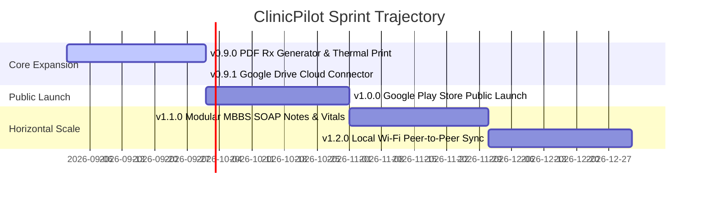

# ClinicPilot Development Progress & Sprint Tracker

This document provides a live tracking ledger of ClinicPilot’s implementation status, active development milestones, technical debt register, automated test coverage, and upcoming delivery sprints.

---

## Table of Contents
1. [Executive Status Dashboard](#1-executive-status-dashboard)
2. [Module Implementation Status](#2-module-implementation-status)
3. [Active Development: Current Milestone](#3-active-development-current-milestone)
4. [Technical Debt & Optimization Register](#4-technical-debt--optimization-register)
5. [Automated Test Suite Health](#5-automated-test-suite-health)
6. [Upcoming Sprints & Roadmap Trajectory](#6-upcoming-sprints--roadmap-trajectory)

---

## 1. Executive Status Dashboard

```
┌────────────────────────────────────────────────────────────────────────┐
│                     CLINICPILOT STATUS SNAPSHOT                        │
├──────────────────────────────┬─────────────────────────────────────────┤
│ Target Version               │ v0.8.8 → v0.9.0 (Path to v1.0 Public)   │
│ Drift Schema Version         │ v13 (Verified non-destructive)          │
│ Automated Tests              │ 598 passing (0 failures)                │
│ Static Analysis              │ 0 warnings / 0 hints (flutter analyze)  │
│ Database Engine              │ SQLite via Drift ORM + SQLCipher AES-256│
│ Target Platforms             │ Android (Split-ABI APK + Play AAB)      │
│ State Management             │ Riverpod 2.x + GoRouter                 │
└──────────────────────────────┴─────────────────────────────────────────┘
```

---

## 2. Module Implementation Status

| Feature Module | Implementation Scope | Status | Verification Reference |
|---|---|:---:|---|
| **Core Database & Schema** | Drift ORM, SQLCipher AES-256 encryption, UUID keys, soft deletes (`isDeleted`), schema migrations v1–v13 | **Complete** | `lib/core/database/` + migration tests |
| **Design System & Theme** | High-contrast clinical tokens (`tokens.dart`, `app_palette.dart`), WCAG AAA contrast, 28+ clinical widgets | **Complete** | `lib/core/design/`, theme compliance test |
| **Patient Directory** | Rapid patient search (name, phone, area, pathology), demographic capture, quick actions | **Complete** | `lib/features/patients/` |
| **Multi-Clinic Rotation** | Independent clinic switching, clinic-level rent prorating, branch-specific contact & consultation metadata | **Complete** | `lib/features/clinics/` |
| **16-Section Master Record** | Mental Generals, Physical Generals, Thermal Reactions, Modalities, Miasmatic Analysis, Posology | **Complete** | `lib/features/cases/` |
| **Complaint Tracker** | Multi-complaint relational progression, baseline vs. follow-up severity scales, symptom notes | **Complete** | `lib/features/cases/` |
| **Posology & Dispensing** | Remedy database, quick potency chips (6C, 30C, 200C, 1M), repetition frequency, prescription notes | **Complete** | `lib/features/posology/` |
| **Financial & Cash Memos** | Cash memo creation, payment method split (Cash/UPI/Card), daily/weekly/monthly P&L, rent prorating | **Complete** | `lib/features/expenses/`, `visits/` |
| **Patient Recall Engine** | Clinic-wide overdue follow-up dashboard, 1-tap WhatsApp deep-links with localized templates, phone dialer | **Complete** | `lib/features/crm/`, `whatsapp_actions_test` |
| **CRM & Growth Loops** | Google Review pipeline (Not Asked -> Link Sent -> Review Added), Community Camp ROI attribution (30/90 days) | **Complete** | `lib/features/crm/` |
| **Pathology & Media** | Pathology investigation logger with auto-abnormal range flags, on-device encrypted image gallery with pan/zoom | **Complete** | `lib/features/consultation/` |
| **Security & Privacy** | Biometric / PIN app lock with inactivity timeout, encrypted `.cpbak` manual backup & restore archive | **Complete** | `lib/core/services/` |

---

## 3. Active Development: Current Milestone

### Milestone `v0.9.0`: Professional PDF Prescription (Rx) Generator
- **Objective**: Provide practicing physicians with an instant, branded digital prescription export.
- **Components in Progress**:
  - `PdfRxService`: Compiles clinic header (logo, address, registration no.), doctor signature, patient vitals, complaints, remedy posology, and diet advice.
  - Portable Bluetooth Thermal Printer support (58mm / 80mm ESC/POS paper output).
  - Direct 1-tap WhatsApp PDF delivery with pre-filled greeting.
- **Estimated Completion**: Immediate priority.

### Milestone `v0.9.1`: Doctor-Owned Google Drive Cloud Backup
- **Objective**: Resolve doctor anxiety regarding device loss without incurring developer server costs or legal privacy liability.
- **Components in Progress**:
  - `GoogleDriveCloudConnector`: Pluggable implementation of `CloudStorageConnector` using `drive.appdata` OAuth2 scope.
  - Automated daily background export of AES-GCM encrypted `.cpbak` archive directly into the doctor's personal Google Drive.

---

## 4. Technical Debt & Optimization Register

| Issue Code | Area | Description | Severity | Target Milestone |
|---|---|---|:---:|:---:|
| **TD-01** | Binary Footprint | Unbundled Google Play Services Barcode Scanning to shrink APK by 8 MB for Play Store distribution. | Low | v1.0.0 |
| **TD-02** | ProGuard / R8 | Formalize plugin keep rules in `proguard-rules.pro` and test release minification on hardware. | Medium | v0.9.2 |
| **TD-03** | Taxonomy Normalization | Standardize free-text disease entries via typeahead chips to prevent fragmentation in disease revenue analytics. | Medium | v1.0.0 |
| **TD-04** | Interoperability | Implement export formatter for HL7 FHIR (R4) JSON to enable hospital referral handoffs. | Low | v1.2.0 |
| **TD-05** | Code Cleanliness | Add braces to one-line control flow statements (`curly_braces_in_flow_control_structures`) across legacy services. | Low | v0.9.0 |

---

## 5. Automated Test Suite Health

ClinicPilot maintains a comprehensive multi-tier test suite enforcing zero regressions across database migrations, state logic, and visual presentation:

```
┌────────────────────────────────────────────────────────────────────────┐
│                       TEST SUITE METRICS                               │
├──────────────────────────────────────┬─────────────────────────────────┤
│ Unit & Business Logic Tests          │ 180+ tests (rent prorating, P&L)│
│ Drift Schema Migration Tests         │ All schema increments (v1–v13)  │
│ Widget & Interaction Tests           │ 250+ tests (screens & dialogs)  │
│ Design System Compliance Tests       │ Verifies 0 raw color literals   │
│ Total Passing Tests                  │ 598 tests                       │
│ Test Failure Count                   │ 0 failures                      │
└──────────────────────────────────────┴─────────────────────────────────┘
```

Verification command:
```powershell
flutter test --no-pub
```

---

## 6. Upcoming Sprints & Roadmap Trajectory



1. **Sprint 1 (v0.9.0)**: Complete PDF Rx generation with letterhead branding, clinic stamp, and thermal print formatting.
2. **Sprint 2 (v0.9.1)**: Deliver automated Google Drive cloud backup via `drive.appdata`.
3. **Sprint 3 (v1.0.0)**: Public Play Store rollout targeting 325k+ Indian homeopathic practitioners with onboarding review loop.
4. **Sprint 4 (v1.1.0)**: Modular Specialty Engine: Universal SOAP Notes and vital curves for MBBS and general practice.
5. **Sprint 5 (v1.2.0)**: Local Wi-Fi multi-device synchronization (doctor phone <-> receptionist tablet) without cloud dependency.
