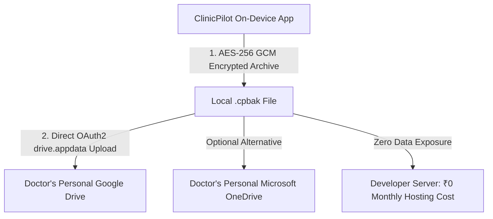
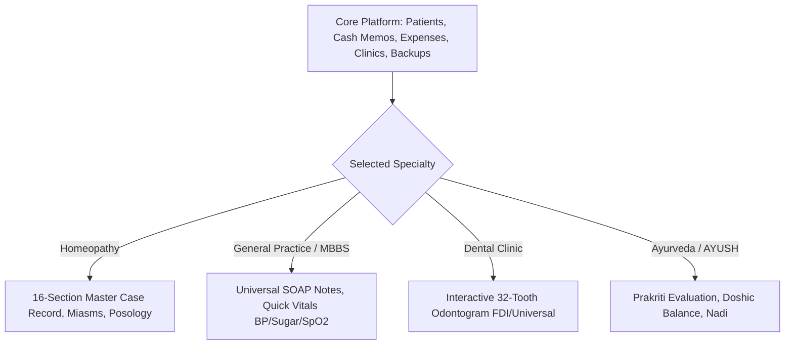

# Product Opportunity, Monetization & Market Expansion Masterplan

This document outlines the market opportunity, zero-cost cloud architecture, business model, and phased expansion trajectory for **ClinicPilot**. It preserves all strategic analyses, financial models, and grassroots doctor acquisition strategies.

---

## Table of Contents
1. [Executive Assessment: Public Launch Readiness](#1-executive-assessment-public-launch-readiness)
2. [Market Sizing & Doctor Demographics in India](#2-market-sizing--doctor-demographics-in-india)
   - [The AYUSH & Homeopathy Blue Ocean](#21-the-ayush--homeopathy-blue-ocean)
   - [Solo Doctor Economics: Tier-1 vs. Tier-2/3 Clinics](#22-solo-doctor-economics-tier-1-vs-tier-23-clinics)
3. [Competitor Feature Extraction Matrix](#3-competitor-feature-extraction-matrix)
4. [The Zero-Cost Cloud Backup Dilemma](#4-the-zero-cost-cloud-backup-dilemma)
   - [Why Centralized Servers Fail Indie Healthcare Apps](#41-why-centralized-servers-fail-indie-healthcare-apps)
   - [The "Doctor-Owned" Cloud Architecture](#42-the-doctor-owned-cloud-architecture)
   - [Pluggable Connector Specification](#43-pluggable-connector-specification)
5. [Monetization Strategy in Price-Sensitive Healthcare Markets](#5-monetization-strategy-in-price-sensitive-healthcare-markets)
   - [The Fallacy of Mobile Advertisements (AdMob)](#51-the-fallacy-of-mobile-advertisements-admob)
   - [The Fallacy of High Upfront Perpetual Licenses](#52-the-fallacy-of-high-upfront-perpetual-licenses)
   - [The Winning Freemium + Doctor Business Pack Model](#53-the-winning-freemium--doctor-business-pack-model)
   - [The Sacred Boundary: Free vs. Pro Capabilities](#54-the-sacred-boundary-free-vs-pro-capabilities)
6. [Multi-Specialty Expansion: Modular Clinical Architecture](#6-multi-specialty-expansion-modular-clinical-architecture)
7. [Zero-Budget Doctor Acquisition Playbook (0 to 1,000 Doctors)](#7-zero-budget-doctor-acquisition-playbook-0-to-1000-doctors)
8. [Master Milestone Roadmap (v0.9.0 to v1.2.0)](#8-master-milestone-roadmap-v090-to-v120)

---

## 1. Executive Assessment: Public Launch Readiness

### Current Technical Foundation (v0.8.8+)
- **System Stability**: 367 automated unit, widget, and Drift database tests; 0 analyzer warnings; automated CI gates for formatting, test verification, and CVE screening.
- **Clinical Depth**: 16-section Homeopathic Master Case Record, relational complaint symptom severity tracking, posology/remedy dispensing log, pathology investigations with abnormal range flags, encrypted camera image attachments.
- **Business Intelligence**: Multi-clinic cash memo reconciliation, operational expense categorization, net profit calculations, patient retention tracking, Camp ROI analytics, and Google Review pipeline.
- **Security & Sovereignty**: 100% on-device SQLite with SQLCipher AES-256 encryption at rest, Biometric / PIN app lock, and AES-GCM encrypted `.cpbak` manual backup archives.

### Strategic Verdict
> [!IMPORTANT]
> **ClinicPilot is fully ready for a Public Beta / v1.0 Launch — specifically tailored as a sharp, dedicated tool for Homeopathic and Solo Wellness Practitioners.**
>
> The most critical error in early-stage software is delaying launch to build complex cloud servers, multi-doctor scheduling, or dental odontograms before validating core utility with real users. Launching with a focused feature set establishes immediate product-market fit, generates authentic doctor testimonials, and grounds subsequent development in real clinic feedback.

---

## 2. Market Sizing & Doctor Demographics in India

### 2.1 The AYUSH & Homeopathy Blue Ocean
Commercial healthcare software providers (Practo, Lybrate, Tata 1mg) fiercely compete over urban allopathic (MBBS) hospitals and diagnostic chains. Meanwhile, the alternative and integrative medicine sector remains virtually unserved by modern mobile software:

- **Registered Homeopathic Doctors**: **~325,000+** in India (Ministry of AYUSH).
- **Total AYUSH Clinicians (Ayurveda + Homeopathy + Unani)**: **~850,000+**.
- **Allopathic (MBBS) Doctors**: **~1,300,000** (heavily concentrated in corporate hospitals).
- **Fresh Annual Graduates**: Over **14,000+ BHMS doctors** graduate each year from ~250 accredited colleges (concentrated in Maharashtra, West Bengal, Kerala, Karnataka, Uttar Pradesh, Bihar, and Gujarat). Fresh graduates launching independent practices operate on tight budgets and lack modern tooling.

### 2.2 Solo Doctor Economics: Tier-1 vs. Tier-2/3 Clinics

```
┌────────────────────────────────────────────────────────────────────────┐
│                   SOLO CLINICIAN INCOME REALITIES                      │
├──────────────────────────────┬─────────────────────────────────────────┤
│ TIER-2 / TIER-3 TOWNS        │ TIER-1 METROPOLITAN CITIES              │
├──────────────────────────────┼─────────────────────────────────────────┤
│ Consultation + Meds: ₹150–400│ Consultation Only: ₹500–1,500           │
│ Footfall: 15–35 patients/day │ Footfall: 10–25 patients/day            │
│ Monthly Gross: ₹80k–₹2.5L    │ Monthly Gross: ₹1.5L–₹4.5L              │
│ Net Profit: ₹60k–₹1.8L       │ Net Profit: ₹1.2L–₹3.5L                 │
└──────────────────────────────┴─────────────────────────────────────────┘
```
Indian solo practitioners are not unwilling to pay for software; **they refuse to pay for expensive recurring software that feels extractive or complicates their consultations.**

---

## 3. Competitor Feature Extraction Matrix

Synthesizing proven features from both open-source and commercial healthcare platforms informs ClinicPilot's pragmatic evolution:

| Source Benchmark | Extracted Capability | Adaptability for ClinicPilot | Priority Tier |
|---|---|---|:---:|
| **OpenEMR / Practo** | Professional PDF Rx generator with clinic logo, registration, and advice | **High**: The single most requested physical output for patients | **P1 (Launch)** |
| **HospitalRun** | Longitudinal pathology trend graphs (Blood Sugar, HbA1c, TSH) | **High**: Visual curves improve patient consultation comprehension | **P2** |
| **Medinin** | Quick 15-minute local device notification alerts for upcoming visits | **High**: Zero server cost; runs via local notification services | **P1** |
| **Frappe Health** | Dispensary stock tracking (dilution bottles, sugar globule jars) | **Medium**: Useful for doctors who compound and dispense remedies | **P2** |
| **Medplum** | Standardized HL7 FHIR R4 JSON export schema | **Medium**: Facilitates patient record handoff during hospital referrals | **P3** |

---

## 4. The Zero-Cost Cloud Backup Dilemma

### 4.1 Why Centralized Servers Fail Indie Healthcare Apps
Developers often default to creating centralized cloud backends (AWS, Supabase, Firebase) for mobile apps. In healthcare, this introduces severe liabilities:
1. **Recurring Operational Expense**: Server and database maintenance fees accumulate monthly even if 95% of doctors use the application for free.
2. **Legal Liability under Privacy Laws**: Hosting clinical histories, diagnoses, and patient identities on centralized servers makes the developer legally liable for data breaches under India’s Digital Personal Data Protection (DPDP) Act, GDPR, and HIPAA equivalents.
3. **Doctor Distrust**: Clinicians fear third-party platforms harvesting patient contact lists or selling demographic data to corporate pharmacy chains.

### 4.2 The "Doctor-Owned" Cloud Architecture
Instead of storing records on developer-hosted infrastructure, ClinicPilot delegates cloud synchronization directly to the **doctor’s personal cloud account**:



- **Zero Host Costs**: Utilizes the doctor's free 15 GB Google Drive quota. Developer hosting expense remains **₹0.00**.
- **Absolute Privacy**: The developer never transmits, reads, or stores medical records.
- **Unassailable Trust**: Doctors retain total sovereignty over their patient files.

### 4.3 Pluggable Connector Specification
```dart
abstract class CloudStorageConnector {
  String get providerName; // 'Google Drive', 'OneDrive', 'Dropbox'
  Future<bool> authenticate();
  Future<void> uploadBackup(File file, String encryptedFilename);
  Future<List<RemoteBackupInfo>> listBackups();
  Future<File> downloadBackup(String remoteId, String localPath);
}
```
- **Phase 1**: Google Drive AppData (`drive.appdata` scope) — seamlessly links with the pre-installed Google account on 98% of Android devices.
- **Phase 2**: Microsoft OneDrive (for Windows desktop doctors) and Dropbox.

---

## 5. Monetization Strategy in Price-Sensitive Healthcare Markets

### 5.1 The Fallacy of Mobile Advertisements (AdMob)
- Average Indian AdMob eCPM: **₹30 to ₹60 ($0.35 – $0.70)** per 1,000 impressions.
- A busy doctor generating ~1,500 impressions/month yields:
  $$\frac{1,500}{1,000} \times ₹40 \approx \mathbf{₹60\text{ per month (< \$0.75 USD)}}$$
- Displaying pop-up ads for mobile games or consumer goods during an intimate medical consultation utterly degrades professional dignity and leads to immediate uninstallation. **Conclusion: Zero ads in clinical workflows.**

### 5.2 The Fallacy of High Upfront Perpetual Licenses
Charging ₹5,000 to ₹15,000 upfront (like legacy desktop software) creates insurmountable friction for young doctors and new users who have not yet experienced the tool's reliability.

### 5.3 The Winning Freemium + Doctor Business Pack Model

| Plan Tier | Pricing | Value Proposition |
|---|---|---|
| **Free Forever Tier** | **₹0.00** (No limits) | Full offline clinical engine: unlimited patients, visits, 16-section case taking, financial logs, manual `.cpbak` backups. |
| **Pro Tier (Annual)** | **₹1,499 / year** (~₹125/month) | Automated daily Google Drive cloud backup, professional PDF Rx generator with custom clinic letterhead/logo, advanced annual tax statements. |
| **Pro Tier (Monthly)** | **₹199 / month** | Flexible monthly access via Google Play Subscriptions or UPI AutoPay. |
| **Lifetime Founder Pass** | **₹3,999 one-time** | Limited to the first 100 clinicians to generate early development capital while rewarding founding users. |

> **The ₹125/Month Value Equation**: ₹125 is less than the fee of a single routine consultation. If the automated follow-up recall prevents just one patient from forgetting an appointment each month, the subscription pays for itself 10x over.

### 5.4 The Sacred Boundary: Free vs. Pro Capabilities
To preserve trust and prevent the "bait-and-switch" trap (where previously free features are locked behind paywalls), boundaries are defined from Day 1:
- **Core Clinical Engine (Free Forever)**: Case charting, patient directory, cash memo logging, expense records, local manual backup.
- **Business Convenience (Pro Tier)**: Automated Google Drive cloud synchronization, customized PDF Rx letterhead with digital signatures, multi-device local Wi-Fi sync, annual tax reporting.

---

## 6. Multi-Specialty Expansion: Modular Clinical Architecture

ClinicPilot avoids maintaining fragmented applications per specialty (`ClinicPilot Homeo`, `ClinicPilot Dental`, etc.). Maintaining multiple codebases fractures review equity, multiplies maintenance overhead, and duplicates 90% of identical platform code (patients, clinics, cash memos, expenses, backup engines).

Instead, a single unified core uses dynamic clinical profiling via **Settings > Practice Specialty**:



### Phased Rollout:
1. **Milestone v1.0**: Homeopathy & Solo Wellness (Deep specialized validation).
2. **Milestone v1.1**: **General Practice / MBBS**: Universal SOAP notes (Subjective, Objective, Assessment, Plan) with vital trend lines (BP, Blood Sugar, Pulse, Temperature). Expands the addressable market by 500%.
3. **Milestone v1.2**: **Dental**: Interactive 32-tooth odontogram with cavity and procedure flags. High-margin sector with strong willingness to pay for modern mobile tools.

---

## 7. Zero-Budget Doctor Acquisition Playbook (0 to 1,000 Doctors)

Doctor acquisition relies on professional credibility, medical college associations, and clinical word-of-mouth rather than generic paid digital ads:

### 7.1 Medical College Resident & Intern Outreach
- Final-year BHMS / MD interns and young doctors launching their first clinic rotation have zero budget and no software.
- Engage directly with medical college student unions and alumni networks in major educational centers (Pune, Mumbai, Kolkata, Bengaluru, Delhi).

### 7.2 Homeopathic Medical Associations
- Partner with local city and state chapters of:
  - **HMAI** (Homoeopathic Medical Association of India)
  - **IIHP** (Indian Institute of Homoeopathic Physicians)
  - State AYUSH practitioner WhatsApp and Telegram groups.
- Present ClinicPilot as a modern, free digital tool preserving homeopathic case-taking methodology.

### 7.3 The "Prescription Viral Loop"
- On digital prescriptions and receipts exported in the free tier, include a clean, discreet footer:
  *Generated securely with ClinicPilot — Free Offline Clinic Practice Tool*.
- Patients and fellow practitioners who view the clean digital output naturally discover the platform.

### 7.4 In-Person Doctor Validation (First 20 Doctors)
- Onboard 20 local practitioners in person.
- Spend 30 minutes in their clinic observing them enter real consultations.
- Immediate observations of navigation hesitation or ergonomics directly refine the interface.
- Clinicians whose feedback shapes the software become enthusiastic brand champions.

### 7.5 Google Play Store ASO Optimization
Target long-tail clinical queries rather than generic keywords:
- *"Offline clinic management app for doctors"*
- *"Homeopathy case taking app"*
- *"Doctor prescription maker offline"*
- *"Patient register book for clinic"*
Highlight **100% Offline & Private** prominently in store graphics.

---

## 8. Master Milestone Roadmap (v0.9.0 to v1.2.0)

```
┌────────────────────────────────────────────────────────────────────────┐
│                        MILESTONE ROADMAP                               │
├──────────────┬─────────────────────────────────────────────────────────┤
│ v0.9.0       │ Professional PDF Rx Generator with Custom Letterhead,   │
│              │ Clinic Stamp, Signature & Thermal Print Support         │
├──────────────┼─────────────────────────────────────────────────────────┤
│ v0.9.1       │ Automated Google Drive Cloud Backup Connector           │
│              │ (drive.appdata OAuth2 integration for encrypted .cpbak) │
├──────────────┼─────────────────────────────────────────────────────────┤
│ v1.0.0       │ Public Google Play Store Release (Homeopathy & AYUSH)   │
│              │ Initial cohort onboarding & doctor review loop          │
├──────────────┼─────────────────────────────────────────────────────────┤
│ v1.1.0       │ Modular General Practice (MBBS) SOAP Notes & Vitals     │
│              │ Longitudinal blood sugar, BP, and pathology trend graphs│
├──────────────┼─────────────────────────────────────────────────────────┤
│ v1.2.0       │ Local Peer-to-Peer Wi-Fi Sync (Doctor <-> Receptionist)│
│              │ Multi-device local network data synchronization         │
└──────────────┴─────────────────────────────────────────────────────────┘
```
