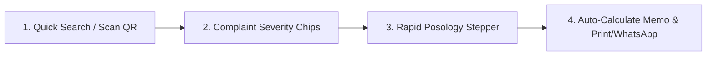

# Clinical UX & Ergonomic Research: High-Intensity OPD Environments

This document details the exhaustive User Experience (UX) and Human Factors Engineering research conducted for **ClinicPilot**. It analyzes the physical, optical, cognitive, and stress constraints governing mobile interaction in high-volume Outpatient Department (OPD) medical clinics.

---

## Table of Contents
1. [The Clinical Setting: Environmental Constraints & Doctor Anthropology](#1-the-clinical-setting-environmental-constraints--doctor-anthropology)
2. [Physical Ergonomics & The One-Handed Thumb Zone](#2-physical-ergonomics--the-one-handed-thumb-zone)
   - [Mobile Dual-Tasking in the Examination Room](#21-mobile-dual-tasking-in-the-examination-room)
   - [Thumb Reach Zone Mapping on Modern Smartphones](#22-thumb-reach-zone-mapping-on-modern-smartphones)
   - [The 48dp Minimum Touch Target Rule](#23-the-48dp-minimum-touch-target-rule)
3. [Optical Ergonomics & High-Contrast Clinical Readability](#3-optical-ergonomics--high-contrast-clinical-readability)
   - [Harsh Ambient Lighting Extremes](#31-harsh-ambient-lighting-extremes)
   - [Contrast Ratios & Typography Standards](#32-contrast-ratios--typography-standards)
   - [Clinical Color Semantics & Meaningful Chromatics](#33-clinical-color-semantics--meaningful-chromatics)
4. [Low-Cognitive-Load Data Entry & Rapid Interaction Patterns](#4-low-cognitive-load-data-entry--rapid-interaction-patterns)
   - [The 60-Second Consultation Encounter Constraint](#41-the-60-second-consultation-encounter-constraint)
   - [Rapid Posology & Remedy Input Steppers](#42-rapid-posology--remedy-input-steppers)
   - [Phonetic & Typo-Tolerant Typeahead Search](#43-phonetic--typo-tolerant-typeahead-search)
   - [Desktop & Tablet Keyboard Shortcuts](#44-desktop--tablet-keyboard-shortcuts)
5. [Error Prevention & Fault-Tolerant UX in High-Stress Clinics](#5-error-prevention--fault-tolerant-ux-in-high-stress-clinics)
   - [Destructive Action Guards & Safety Interlocks](#51-destructive-action-guards--safety-interlocks)
   - [Asynchronous "Undo" Snackbars vs. Disruptive Modals](#52-asynchronous-undo-snackbars-vs-disruptive-modals)
   - [Non-Volatile Consultation Auto-Save Draft Buffers](#53-non-volatile-consultation-auto-save-draft-buffers)
   - [Zero-Latency Reactive Feedback & Drift Transactions](#54-zero-latency-reactive-feedback--drift-transactions)

---

## 1. The Clinical Setting: Environmental Constraints & Doctor Anthropology

The typical outpatient clinic is a high-distraction, sensory-dense, and time-pressured workspace:
- **Rapid Patient Turnover**: A solo practitioner in India manages between 15 to 35 patients in a 3-hour evening window (approximately 5 to 10 minutes per encounter).
- **Sensory Fatigue**: Clinicians arrive at evening private clinics following full daytime shifts at hospitals or medical colleges. Physical and cognitive exhaustion are pervasive.
- **Continuous Interruptions**: Consultations are frequently punctuated by family members speaking simultaneously, phone inquiries, incoming lab deliveries, and physical diagnostic tasks.
- **The "Digitization Penalty"**: When electronic medical records demand complex menu traversal, eye contact with the patient is broken. Doctors perceive software not as an aid, but as an administrative tax imposed upon their clinical intuition.

> [!IMPORTANT]
> **The Golden Design Law of ClinicPilot**:
> If recording a clinical consultation or issuing a receipt takes more than 60 seconds or requires two hands, it will be abandoned in favor of scrap paper. Every screen must respect the clinician's cognitive budget.

---

## 2. Physical Ergonomics & The One-Handed Thumb Zone

### 2.1 Mobile Dual-Tasking in the Examination Room
During physical evaluations, the physician rarely has both hands free:
- One hand holds a stethoscope, palpates the abdomen, positions an otoscope, or holds a patient’s wrist for pulse diagnosis (*Nadi Pariksha*).
- The other hand holds the smartphone.
- Consequently, **every primary action in ClinicPilot must be fully operable using a single thumb**.

---

### 2.2 Thumb Reach Zone Mapping on Modern Smartphones
On contemporary mobile devices (screens measuring 6.3" to 6.8" diagonally), thumb accessibility divides into three biomechanical zones:

```
┌───────────────────────────────────────────────┐
│ [← Back]                   [Clinic Settings] │ <── HARD / IMPOSSIBLE ZONE (Top 25%)
│                                               │     Requires hand readjustment.
│   Patient Identification & Demographics       │     Strictly for passive labels
│                                               │     and non-urgent display.
├───────────────────────────────────────────────┤
│                                               │ <── STRETCH ZONE (Middle 35%)
│   Chief Complaints & Severity Sliders         │     Reachable with mild thumb
│                                               │     extension. Form fields & cards.
│                                               │
├───────────────────────────────────────────────┤
│  [  Remedy Selection  ]  [ Potency Chips ]    │ <── NATURAL ZONE (Bottom 40%)
│  [ OD ] [ BD ] [ TDS ]   [ 7 Days Stepper]    │     Optimal ergonomic comfort.
│  ┌─────────────────────────────────────────┐  │     Primary action buttons,
│  │     [ + COMPLETE & ISSUE RX ]           │  │     bottom sheets, primary CTAs.
│  └─────────────────────────────────────────┘  │
└───────────────────────────────────────────────┘
```

#### Engineering Architecture for the Natural Zone:
1. **Modal Bottom Sheets over Centered Dialogs**: All quick-entry tools (adding an expense, recording a cash memo, selecting a potency) emerge from the bottom of the screen (`showModalBottomSheet`), anchoring interactive targets in the Natural Zone.
2. **Bottom-Anchored CTAs**: The primary call-to-action button (e.g., *"Save Consultation"*, *"Record Payment"*, *"Send WhatsApp Reminder"*) is persistently docked above the system navigation bar, pinned to the bottom.
3. **Downward Screen Flow**: Important interactive controls are grouped near the lower half, leaving passive summaries and historical context at the top.

---

### 2.3 The 48dp Minimum Touch Target Rule
Tired hands, physical vibrations, and rapid typing lead to frequent finger mis-strikes:
- **Strict Adherence to WCAG 2.1 AAA & Material 3**: Every clickable element (chips, buttons, icon links) must provide an absolute minimum touch target hitbox of **48 × 48 device-independent pixels (dp)**.
- **Hitbox Extension**: If an icon visually measures 24 × 24 dp, its interactive wrapping container (`IconButton`, `GestureDetector` with `hitTestBehavior: HitTestBehavior.opaque`) must enforce `padding: EdgeInsets.all(12)` or `constraints: BoxConstraints(minWidth: 48, minHeight: 48)`.
- **Target Spacing**: A minimum inter-target boundary of **8dp** is enforced between adjacent chips (e.g. posology frequency chips) to prevent adjacent mis-selection.

---

## 3. Optical Ergonomics & High-Contrast Clinical Readability

### 3.1 Harsh Ambient Lighting Extremes
Medical devices encounter severe ambient illumination volatility:
1. **Harsh Overhead Glare**: Direct unshielded fluorescent tube lights or cheap LED battens common in budget Indian clinics produce severe screen glare.
2. **Outdoor Sunlit Glare**: Community medical screening camps operated under open-air canopies or direct daylight wash out low-contrast UI palettes.
3. **Dim Examination Corners**: Darkened examination rooms during ophthalmoscope inspection or pediatric rest require interfaces that do not blind the physician or disturb resting patients.

---

### 3.2 Contrast Ratios & Typography Standards
- **Strict WCAG AAA Contrast**: Body text achieves a minimum contrast ratio of **7:1** against backgrounds; large headlines and key visual chips achieve at least **4.5:1**.
- **Prohibition of Low-Contrast Grays**: Muted gray text (`#9E9E9E` or lighter) is forbidden for critical clinical labels. Secondary metadata uses rich slate tones (`#475569` on light; `#94A3B8` on dark).
- **Prohibition of Pure Black on Pure White**: Rendering `#000000` text on a `#FFFFFF` canvas causes optical vibration and rapid eye fatigue under fluorescent lights. ClinicPilot utilizes:
  - **Light Theme**: Deep slate text (`#0F172A`) over an off-white, anti-glare canvas (`#F8FAFC`).
  - **Dark Theme**: Crisp cool white text (`#F1F5F9`) over a deep charcoal substrate (`#0F172A` / `#1E293B`).
- **Tabular Figures for Numerical Data**: All monetary amounts, lab values, and potencies utilize monospaced numerical glyphs (`fontFeatures: [FontFeature.tabularFigures()]`) to ensure clean vertical alignment across ledger lists.

---

### 3.3 Clinical Color Semantics & Meaningful Chromatics

Color is never used purely for decoration; it communicates immediate clinical triage status:

```
┌────────────────────────────────────────────────────────────────────────┐
│                      CLINICAL COLOR SYSTEM                             │
├──────────────┬──────────┬──────────────┬───────────────────────────────┤
│ Semantic Role│ Hex Code │ Meaning      │ Clinical Application          │
├──────────────┼──────────┼──────────────┼───────────────────────────────┤
│ DANGER /     │ #DC2626  │ Acute Risk / │ Out-of-range lab pathology,   │
│ CRITICAL     │          │ Debt         │ severe symptom exacerbation,  │
│              │          │              │ patient outstanding balance   │
├──────────────┼──────────┼──────────────┼───────────────────────────────┤
│ WARNING      │ #D97706  │ Needs Action │ Overdue follow-up visit,      │
│              │          │              │ pending lab result, review gap│
├──────────────┼──────────┼──────────────┼───────────────────────────────┤
│ SUCCESS      │ #16A34A  │ Positive     │ Clinical remission, settled   │
│              │          │ Resolution   │ invoice, active Google review │
├──────────────┼──────────┼──────────────┼───────────────────────────────┤
│ CLINICAL     │ #2563EB  │ Information  │ Homeopathic remedy, baseline  │
│ PRIMARY      │          │              │ vital sign, clinic identity   │
└──────────────┴──────────┴──────────────┴───────────────────────────────┘
```

> [!CAUTION]
> **Accessibility Caveat**: Approximately 8% of male physicians possess red-green color vision deficiency (deuteranomaly/protanomaly). Color must **always be accompanied by secondary visual cues** (such as warning icons `⚠️`, directional trend arrows `↑ / ↓`, or explicit text badges `[ABNORMAL]`).

---

## 4. Low-Cognitive-Load Data Entry & Rapid Interaction Patterns

### 4.1 The 60-Second Consultation Encounter Constraint
To prevent record-keeping from detracting from patient care, ClinicPilot structures clinical encounter entry into a streamlined, high-speed flow:



---

### 4.2 Rapid Posology & Remedy Input Steppers
Typing repetitive homeopathic potencies and dosages letter-by-letter on a mobile virtual keyboard is slow and prone to typographical errors.

#### The Posology Stepper Component:
1. **Potency Quick-Chips**: Selecting a remedy immediately reveals one-tap potency chips:
   `[ Q / LM ]` `[ 6C ]` `[ 30C ]` `[ 200C ]` `[ 1M ]` `[ 10M ]` `[ Mother Tincture (Q) ]`
2. **Repetition Dosage Pills**: Frequency is chosen in a single tap:
   `[ Single Dose (Stat) ]` `[ OD (Once Daily) ]` `[ BD (Twice Daily) ]` `[ TDS (Thrice Daily) ]`
3. **Duration Counter**: A large +/- numeric stepper defaulting to `[ 7 Days ]` with quick increments (`+7`, `+14`, `+30`).

---

### 4.3 Phonetic & Typo-Tolerant Typeahead Search
Homeopathic Materia Medica incorporates thousands of complex botanical and mineral Latin nomenclature (*Arsenicum album*, *Lycopodium clavatum*, *Phosphoricum acidum*, *Causticum hahnemanni*).
- **Phonetic & Prefix Match Engine**: The search engine indexes standard abbreviations and phonetic stems. Typing `"ars alb"` instantly matches *Arsenicum Album*; typing `"nux"` instantly suggests *Nux Vomica*.
- **Offline Trigram Indexing**: Built using local SQLite SQLite `LIKE` and custom FTS tokenization, resolving in under **10 milliseconds** without sending network requests.

---

### 4.4 Desktop & Tablet Keyboard Shortcuts
When ClinicPilot runs on desktop workstations (Windows / macOS) or tablet docks in the clinic reception:
- **Global Patient Search**: `/` or `Ctrl + F` focuses the search bar from any view.
- **New Consultation**: `Ctrl + N` launches the encounter flow for the active patient.
- **Print / PDF Prescription**: `Ctrl + P` directly renders the PDF prescription preview.
- **Fast Tab Navigation**: Form fields are logically ordered with `TextInputAction.next` enabling continuous keyboard traversal without touching the mouse.

---

## 5. Error Prevention & Fault-Tolerant UX in High-Stress Clinics

### 5.1 Destructive Action Guards & Safety Interlocks
In a rushed clinic, an accidental swipe or tap must never cause catastrophic data loss:
- **Hard Confirmations for Irreversible Actions**: Deleting a patient profile, removing a clinic branch, or purging financial databases requires a two-step confirmation dialog displaying the specific entity name and the count of associated records (e.g. *"Deleting Dr. Zaid's Clinic B will also remove 142 visit records and 85 cash memos"*).
- **Physical Color Cue**: Destructive buttons use danger red (`#DC2626`) with explicit text (*"Delete Permanently"*), separating them physically from neutral cancel buttons.

---

### 5.2 Asynchronous "Undo" Snackbars vs. Disruptive Modals
Interrupting the doctor with a confirmation dialog for minor daily actions (such as removing a single complaint line or deleting an expense entry) introduces unnecessary friction:
- **The Optimistic Undo Pattern**: The item immediately disappears from the UI, and a floating **6-second Snackbar** appears at the bottom with an `[ UNDO ]` button.
- If the doctor made an error, a single tap restores the item instantly. If no action is taken, the underlying SQLite deletion commit finalizes silently.

---

### 5.3 Non-Volatile Consultation Auto-Save Draft Buffers
If the doctor is interrupted mid-case by an urgent phone call, an incoming patient emergency, or an operating system memory reclaim:
- Every keystroke and chip selection in the active encounter is saved to an on-device transient SQLite table (`consultation_drafts`).
- Upon relaunching ClinicPilot or navigating back to the patient profile, an unobtrusive banner appears:
  `"Unsaved consultation from 15 minutes ago found. [ Restore Draft ] [ Discard ]"`
- Eliminates the frustration of re-interviewing the patient to reconstruct notes.

---

### 5.4 Zero-Latency Reactive Feedback & Drift Transactions
- **Immediate Optimistic UI Updates**: Riverpod state providers update UI state immediately upon user action, dispatching database writes asynchronously in background Drift SQLite transactions.
- **Elimination of Blocking Spinners**: The interface never freezes behind full-screen loading spinners during normal data logging. The app feels instantaneous, responsive, and reliable.
