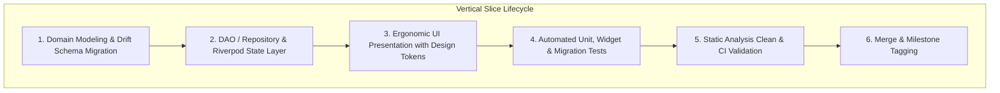

# ClinicPilot — Capability Roadmap & Engineering Governance

> **Systematic Milestone Execution Matrix for ClinicPilot Practice Operating System**  
> *Translating Clinical Needs into Verifiable, Test-Driven, Offline-First Engineering Deliverables.*

---

## 1. Overview & Roadmap Architecture

The **ClinicPilot Capability Roadmap** outlines the strategic engineering path from local prototype to a hardened, field-tested clinical operating system for solo outpatient practitioners. 

Rather than chasing generic enterprise feature-completeness, every milestone is strictly gated by **clinical utility in a fast-paced OPD**, **100% offline data durability**, and **measurable impact on practice sustainability and growth**.

```
docs/roadmap/
├── README.md   # [You Are Here] Methodology, SemVer strategy, and milestone governance
└── roadmap.md  # Detailed, feature-by-feature capability breakdown across M1 through M6+
```

---

## 2. Development Methodology: Vertical Slice Architecture

ClinicPilot rejects horizontal layer development (building all database tables first, then all UI screens months later). Features are developed and shipped in **end-to-end Vertical Slices**:



### Engineering Quality Gates for Every Vertical Slice:
1. **Zero Hardcoded Design Tokens**: All colors, paddings, border radii, and text styles must reference `core/design/tokens.dart` and `AppTheme`. Verified automatically via `test/theme_compliance_test.dart`.
2. **Schema Durability & Migration Test**: Any change to Drift SQLite tables must increment `schemaVersion` and include explicit `onUpgrade` migrations with rollback safety and JSON serialization fallback tests.
3. **Sub-Second Performance Budget**: Critical paths (patient search, case opening, bill creation) must execute in under 200ms with zero frame drops (60 FPS minimum).
4. **Memory Hygiene**: All `TextEditingController`, `FocusNode`, `ScrollController`, and `StreamSubscription` instances must be explicitly disposed.

---

## 3. Versioning Strategy (SemVer) & Release Cadence

ClinicPilot adheres strictly to **Semantic Versioning 2.0.0** (`MAJOR.MINOR.PATCH`):

```
vMAJOR.MINOR.PATCH
 │     │     └── PATCH: Bug fixes, UI hotfixes, and regression patches (e.g. v0.8.9)
 │     └──────── MINOR: New milestone capabilities, schema migrations, and features (e.g. v0.9.0)
 └────────────── MAJOR: Public v1.0 Production Release & API stability (e.g. v1.0.0)
```

| Version Band | Milestone Mapping | Operational Stability | Target Audience |
|---|---|---|---|
| **v0.1.x – v0.4.x** | **M1: Core OPD Engine & Local Database** | Alpha (Prototype) | Internal developer dogfooding |
| **v0.5.x – v0.7.x** | **M2: Multi-Clinic Tenancy & Finances** | Beta (Single Doctor) | Dr. Zaid (Babu Bazar Chamber) |
| **v0.8.x – v0.9.x** | **M3 & M4: Case Taking, Repertory & Inventory** | Release Candidate | Closed group of 5–10 solo homeopaths |
| **v0.9.x – v0.9.9** | **M5: Backup Containers & P2P Sync** | Hardened Release Candidate | Multi-clinic practitioners testing sync |
| **v1.0.0+** | **M6+: Public Production Release** | General Availability (GA) | Public Play Store release for independent doctors |

---

## 4. Milestone Status Summary

Below is the executive tracking status of ClinicPilot's core development milestones:

| Milestone | Capability Name | Primary Clinical Value | Status | Target / Version |
|---|---|---|:---:|:---:|
| **M1** | **Core OPD Engine & Local Database** | Instant patient registration, local SQLite persistence, basic cash memo generation. | ✅ **Completed** | `v0.2.0` |
| **M2** | **Multi-Clinic Scoping & Financial Analytics** | Clinic tenancy switcher, expense logging, net profit calculation, daily reconciliation. | 🔄 **In Progress** | `v0.5.0` – `v0.7.0` |
| **M3** | **17-Section Homeopathic Case Engine** | Structured symptom triage, rubric lookup, totality scoring, longitudinal case sheet. | 📋 **Planned** | `v0.8.0` |
| **M4** | **Pharmacy Inventory & Dispensing** | Remedy catalog, decimal/centesimal potencies, batch expiry, auto-depletion. | 📋 **Planned** | `v0.8.5` |
| **M5** | **Encrypted Backup & Selective Sync** | Zero-knowledge AES-256 backup, Google Drive connector, local Wi-Fi sync. | 📋 **Planned** | `v0.9.0` |
| **M6+** | **v1.0 Production Readiness & Scaling** | Thermal printing, specialty switcher (SOAP/Dental), practice growth intelligence. | 🚀 **Future** | `v1.0.0` |

---

## 5. Navigating the Detailed Roadmap

For an in-depth breakdown of individual deliverables, acceptance criteria, schema migrations, and UI specifications for each milestone, consult:
👉 [**Comprehensive Capability Roadmap (`docs/roadmap/roadmap.md`)**](./roadmap.md)
